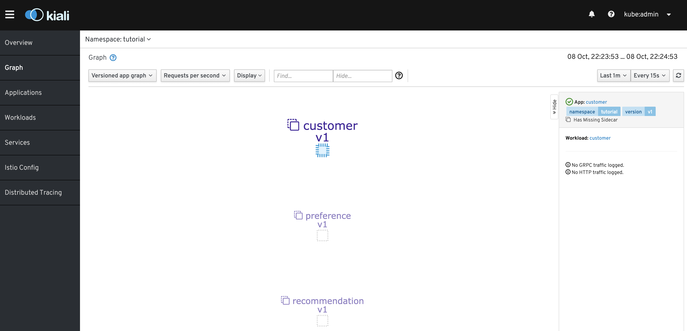
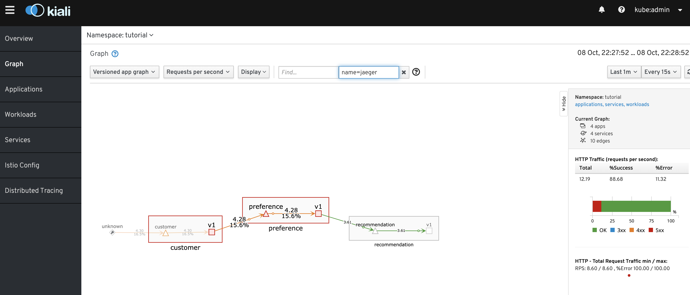

= Cluster creation and Operators

It is easy to use Installer Provisioned Infrastructure to create a small OpenShift 4.1 platform for your use. 

== Installing OpenShift

== Installing Service Mesh 
We'll install Service Mesh (and it's pre-req)
We'll learn the basics of the toy project in this section

=== Installing pre-req operators
See link:https://learning.redhat.com/mod/scorm/player.php?scoid=2877&cm=5623&display=popup[this] lab in the RedHat LMS.

Changes from the LMS:
* there is now a ServiceMesh operator available from operator hub (but you still need to create istio-system project and use the service-mesh.yml file in this project)

include::includes/common.adoc[]

Pre-reqs
----
# Env setup
cdd
. 00-ato-shell-setup-istio-install.sh

# Prepare for this section by removing previous instance of 
# demo project
cdd
./02-ato-service-mesh-prep.sh
----

== Create our (toy) project
* Create the project that we'll be operating on for this demo

----
cdd
./02-ato-no-service-mesh-setup.sh
----

* _Shell:_ Start load generation and see services come up

----
cdd
./ato-load-gen.sh customer

Starting load gen for customer-tutorial.apps.ato-demo-replica.openshifttc.com.  Proceed? (y/N) y
----

* _Kiali_: Once load starts building, open link:https://kiali-istio-system.apps.ato-demo-replica.openshifttc.com/console/graph/namespaces/?edges=requestsPerSecond&graphType=versionedApp&unusedNodes=false&injectServiceNodes=true&duration=60&pi=10000&namespaces=tutorial&layout=dagre[Kiali]
** Show that our project is not one of the ones that can be monitored

== Add our project to the service mesh

* Service Mesh (Istio) needs to know what projects are under its control.  
** Amongst other things, it needs to install an Envoy "sidecar" to each of the microservice

* We need to update a service-mesh-member-roll to register our project for service mesh
** But once registered, the system will do a bunch of stuff for us automatically

----
cdd
cat service-mesh-roll.yaml
./ato-restart-service-mesh.sh tutorial --no-kill
----

* _Kiali_: Open link:https://kiali-istio-system.apps.ato-demo-replica.openshifttc.com/console/graph/namespaces/?edges=requestsPerSecond&graphType=versionedApp&unusedNodes=false&injectServiceNodes=true&duration=60&pi=10000&namespaces=tutorial&layout=dagre[Kiali] 
** Notice that the project can now be selected
*** You may need to select "Show Empty Nodes"
** Notice the lack of sidecars

* Now that we're registered for the service mesh, we need to restart our pods to give Service Mesh a chance to inject the _sidecars_ into them
** Show this by issuing the following and pointing out the 2/2 now
----
cdd
./ato-bounce-pods.sh tutorial
oc get pods -w
----

* Make sure to show _Shell_ and _Kiali_ as things are starting up
** NOTE: if using springboot, the preference container will take a while to start up

== Review changes in Kiali
* _Kiali_: Open link:https://kiali-istio-system.apps.ato-demo-replica.openshifttc.com/console/graph/namespaces/?edges=requestsPerSecond&graphType=versionedApp&unusedNodes=false&injectServiceNodes=true&duration=60&pi=10000&namespaces=tutorial&layout=dagre[Kiali] again
** point out that the sidecars can now be seen
** notice the flow

