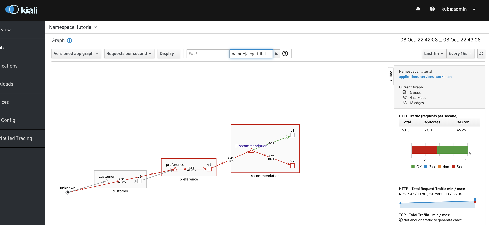
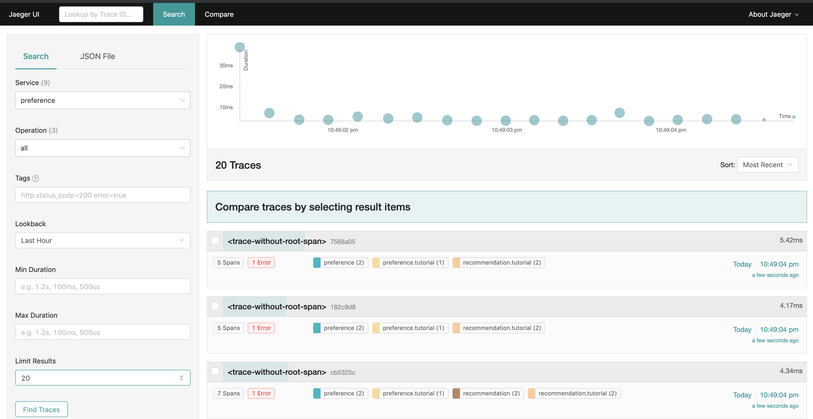
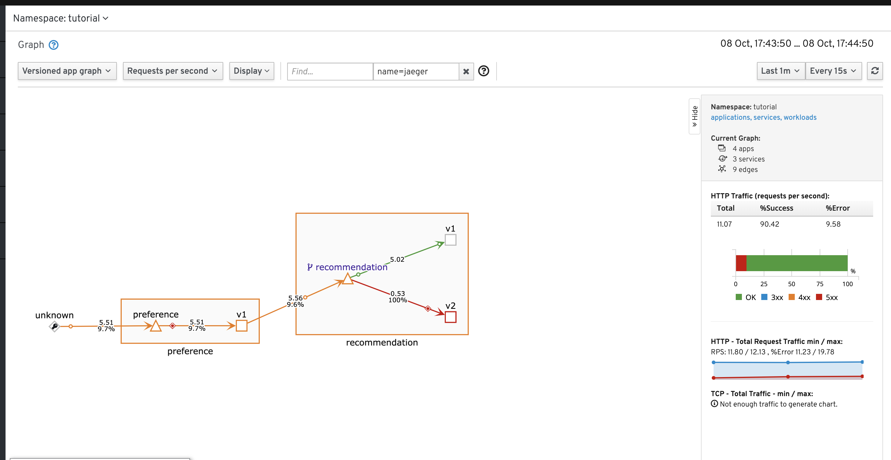

= Smarter Canary Releases with Service Mesh

In this section we'll see how Service Mesh can help us fine tune our releases, even helping us debug in production.  In this case, we'd like to have two versions of our recommendation service.

include::includes/common.adoc[]

Pre-reqs
----
# Env setup
cdd
. 00-ato-shell-setup-istio-install.sh

#Service Mesh Installed
cdd
./ato-restart-service-mesh.sh

# Ensure preference service is exposed
cdd
oc expose service preference

#Initial route rules for recommendation (for naive load balancing)
cdd
./03-ato-canary-demo-prep.sh
----

== Deploy new Recommendation Service
* _Shell_: Ensure loadgen is running and run through the *preference* pod
----
cdd
./ato-load-gen.sh preference
----

* Notice that only v1 recommendations are coming through

* Deploy our new (buggy) version (with destination rules and virtual service)
** Show and explain destination rules (what to do once traffic is routed there)
** Show and explain virtual services (way of routing things, even at layer 7)
----
cdt
cat recommendation/kubernetes/Deployment-v2-buggy.yml

oc apply -f recommendation/kubernetes/Deployment-v2-buggy.yml -n tutorial
oc get pods -w
----
* Wait until pods come up

* _Shell:_ Show that preference is now getting errors half the time

* _Kaili:_ Service Mesh allows you to visualize your traffic
** Show traffic flow through link:https://kiali-istio-system.apps.ato-demo-replica.openshifttc.com/console/graph/namespaces/?edges=requestsPerSecond&graphType=versionedApp&unusedNodes=false&injectServiceNodes=true&duration=60&pi=15000&namespaces=tutorial&layout=dagre[Kiali]
** Notice that it's coming from preference and the split is 50/50

== OK Solution: Limit the expose of the new service

* Now let's create a virtual service that mostly sends traffic to v1
----
cdt
cat istiofiles/virtual-service-recommendation-v1_and_v2.yml
oc apply -f istiofiles/virtual-service-recommendation-v1_and_v2.yml
----

* _Jaeger:_ We can also see the issues in a trace
** Open link:https://jaeger-istio-system.apps.ato-demo-replica.openshifttc.com/search?end=1570510882936000&limit=20&lookback=1h&maxDuration&minDuration&service=preference&start=1570507282936000[Jaeger] to take a look at the trace
** notice that there was some retry going on

* _Kiali_: Again show the changed traffic flow through link:https://kiali-istio-system.apps.ato-demo-replica.openshifttc.com/console/graph/namespaces/?edges=requestsPerSecond&graphType=versionedApp&unusedNodes=false&injectServiceNodes=true&duration=60&pi=15000&namespaces=tutorial&layout=dagre[Kiali]
** Notice that it's coming from preference and the split is now about 10%
** Has gone from angry red errors to orange

== Using Istio for better canary releases (dark release)
Getting traffic routed at 50% or event 10% isn't great whilst the service is failing.  Let's allow the pod to run, but not be exposed 
to the public so that we can debug it

* Show Service Mesh *mirroring* functionaly
----
cdt
cat istiofiles/virtual-service-recommendation-v1-mirror-v2.yml
oc apply -f istiofiles/virtual-service-recommendation-v1-mirror-v2.yml
----

* _Shell_: Take a look at changes to the output
** Should be no errors

* _Kiali_: Review graph

[.underline]#Next# let's use a local IDE to debug into our troubled pod and see what the issue is.
