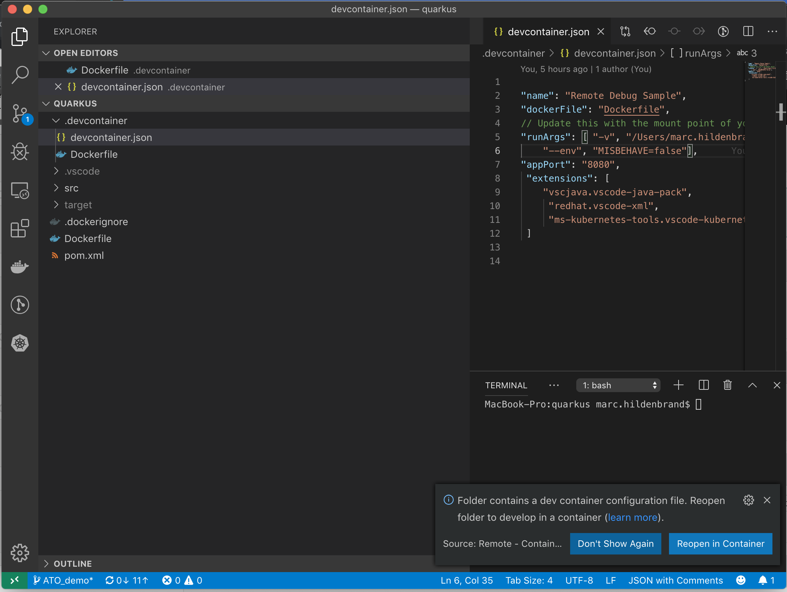

= Polyglot Microservices
include::includes/common.adoc[]

We want to see for ourselves what is causing the error coming back from the recommendation pod

Pre-req
----
# Project should be installed

# Service Mesh should be installed

# Real Recommendation v2 should be running
----

== Locking down the pods

One of the key benefits of Istio is security.  But to have the greatest security, call calls into and out of the mesh should be mediated by Istio.

* _Shell_ First make sure we can see traffic being routed through customer
----
cdd
./ato-load-gen.sh customer
----

* Apply a _Network Policy_ to force all traffic into and out of the mesh through Istio
----
cdd
oc apply -f network-policy.yaml
----

* Notice that traffic can no longer get through the route

** Potentially also check routes from tutorial project in OpenShift

== Creating a new way in

* First, we need to create a "gateway" for ingress into the Service Mesh

----
cdt
cat customer/kubernetes/Gateway-no-virtual-service.yml
oc apply -f customer/kubernetes/Gateway-no-virtual-service.yml
----
** Notice that the istio-gateway already has a public URL (see _OpenShift istio-system project)

* Next, create a virtual service (and destination rule) that listens for incoming connections from that gateway (looking for a match on the URL)
----
clear
cdt
cat customer/kubernetes/virtual-service-customer-v1_only.yml
oc apply -f customer/kubernetes/destination-rule-customer-v1-v2.yml
oc apply -f customer/kubernetes/virtual-service-customer-v1_only.yml
----
** Notice the _/customer_ suffix.  This will get appended to the istio-gateway's base URL
** Notice also the 0 weight for a v2 subset (which we're about to add)

== Route traffic through Service Mesh

* Let's move everything through the gateway-url using the "/customer" suffix
----
cdt
./ato-load-gen.sh customer istio

Starting load gen for istio-ingressgateway-istio-system.apps.ato-demo-replica.openshifttc.com/customer.  Proceed? (y/N)y
----
** Notice the url: istio-ingressgateway-istio-system.apps.ato-demo-replica.openshifttc.com/*customer*.
** Traffic to v1 and v2 recommendation is still 50/50 as we left it

* _Kiali_: Open link:https://kiali-istio-system.apps.ato-demo-replica.openshifttc.com/console/graph/namespaces/?edges=requestsPerSecond&graphType=versionedApp&namespaces=tutorial&unusedNodes=true&injectServiceNodes=true&duration=60&pi=15000&layout=dagre[Kiali] and show traffic going through the gateway

== Create a dotnet customer service

We want to deploy to a v2 slot for customer.  You could imagine this is the beginning of the strangler pattern (monolith to micro..becomes clearer with Kiali). First we have to build it.

* Clone our Azure development repo
----
mkdir -p ~/Downloads/demo
cd ~/Downloads/demo
git clone https://mhildenb@dev.azure.com/mhildenb/ato-pipeline-demo/_git/ato-pipeline-demo
cd ato-pipeline-demo
git checkout --track origin/Demo_Deploy
----

* Open the customer dotnet project in VSCode
----
cd ~/Downloads/demo/ato-pipeline-demo/customer/dotnet
code .
----

* Select *Open Folder in Container*

* Select *Open Folder in Container*
** Show the development container: *Dockerfile*
*** point out oc install (for remote debug)
** Show *.devcontainer.json*
*** show the port forwarding (52000) and omnisharp plugins
*** show volume mount

* Open the ValuesController and make a change to the string

* Set a breakpoint is Program.cs
** in `{public static void Main(string[] args)}`

* Set a breakpoint in ValuesController.cs
** in `{public string Get()}`

* Select Debug tab, press play
** will be prompted to create a Dot build conf

== Debugging

* First breakpoint should hit be in:
** `{public static void Main(string[] args)}`

* Then go to shell
----
curl localhost:52000
----
** This will hit `{public string Get()}`

* Change hostname variable on the fly
** Show this in the shell

== Checkin

* Go to the git tab

* Stage changes, make commit message

WARNING: Before you deploy you need to make sure the service account has been created and the token updated
----
scripts/ato-demo-version-03/ato-create-deployer-service-account.sh

oc get sa azure-deploy -o yaml
oc get secret azure-deploy-token-vwmm4 -o yaml
----

* Push origin

* NOTE: Quickly move on to link:https://dev.azure.com/mhildenb/ato-pipeline-demo/_build?definitionId=2&_a=summary[Azure Pipelines] to show this in realtime

[.underline]#Next# we should see a pipeline triggered
