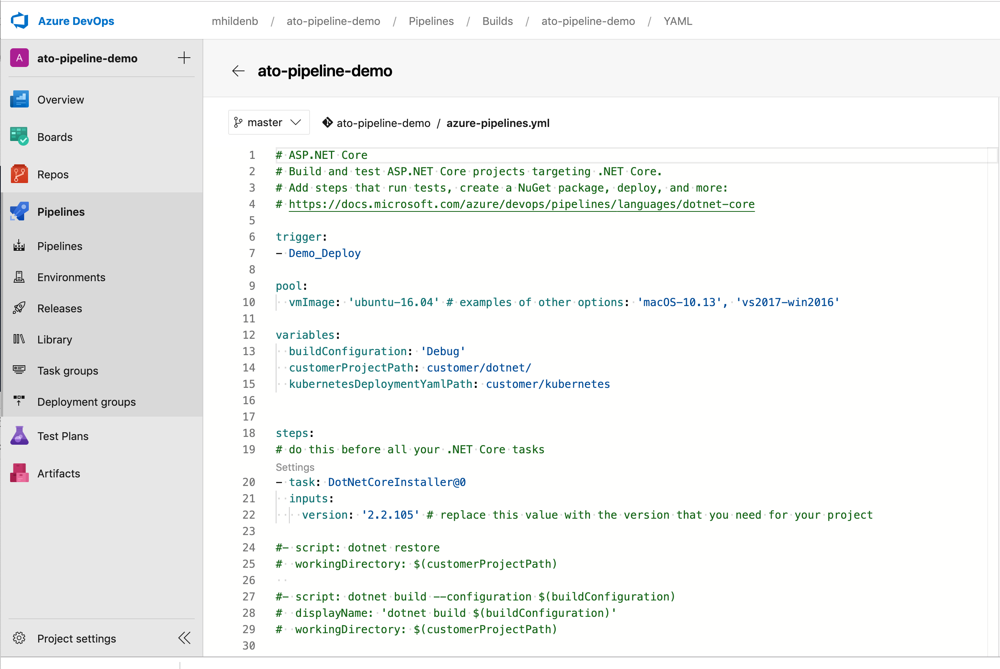
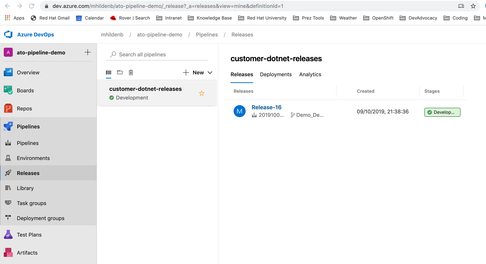
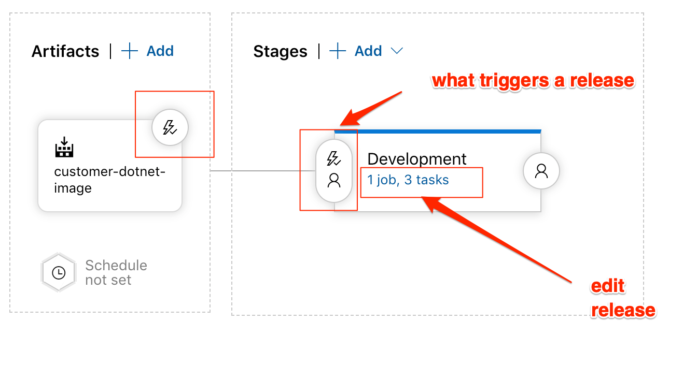

= Azure Pipeline Integration
include::includes/common.adoc[]

Pre-req
----
# Running Customer

# Azure git repo cloned and something pushed

----

== Continuous Integration

* Open the link:https://dev.azure.com/mhildenb/ato-pipeline-demo/_build?definitionId=2&_a=summary[Azure Pipeline]

* Open the running job

* Look at the link:https://dev.azure.com/mhildenb/ato-pipeline-demo/_apps/hub/ms.vss-build-web.ci-designer-hub?pipelineId=2&branch=master[Edit] screen

* Point out:
** Triggered on checkin into our branch
** Getting the sdk and using our *pub.sh* build script
** Building Docker Image, which goes to dockerhub
** Publishing Artefact (yaml files)

== Continuous Deployment

* Open the link:https://dev.azure.com/mhildenb/ato-pipeline-demo/_release?_a=releases&view=mine&definitionId=1[Releases]

* Open the link:https://dev.azure.com/mhildenb/ato-pipeline-demo/_releaseProgress?_a=release-environment-logs&releaseId=16&environmentId=16[logs] of a successful release

* link:https://dev.azure.com/mhildenb/ato-pipeline-demo/_releaseDefinition?definitionId=1&_a=environments-editor-preview[Edit] the release

* Point out items in image
** Artefact trigger
** Release Trigger
** Release Steps

* Show Kubernetes (OpenShift) link:https://dev.azure.com/mhildenb/ato-pipeline-demo/_settings/adminservices?resourceId=a5da1279-4330-478e-b4c1-6bdc1af0e89a&resource=%5Bobject%20Object%5D&_a=resources[connection settings]
** Mention that to setup
** Need to associate service account and give edit rights to project (see also: scripts/02-ato-no-service-mesh-setup.sh)
** Need to get a token for that service account

* Key point is that the deployment.yml is updated with the recent build tag

== Proof

* Open the OpenShift deployment for Customer-v2

* Show the same docker build as sent through
