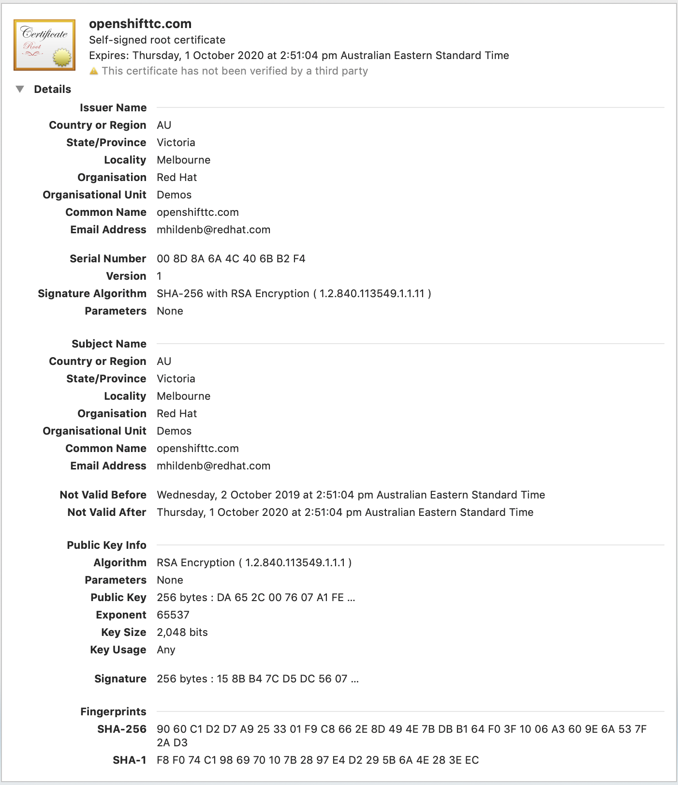
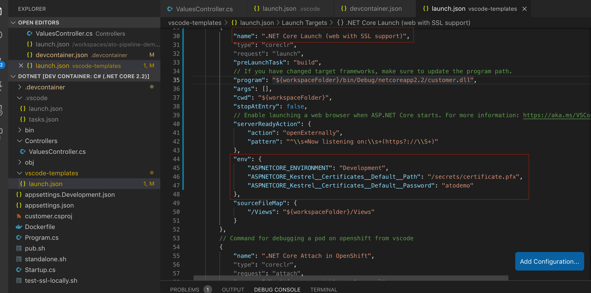
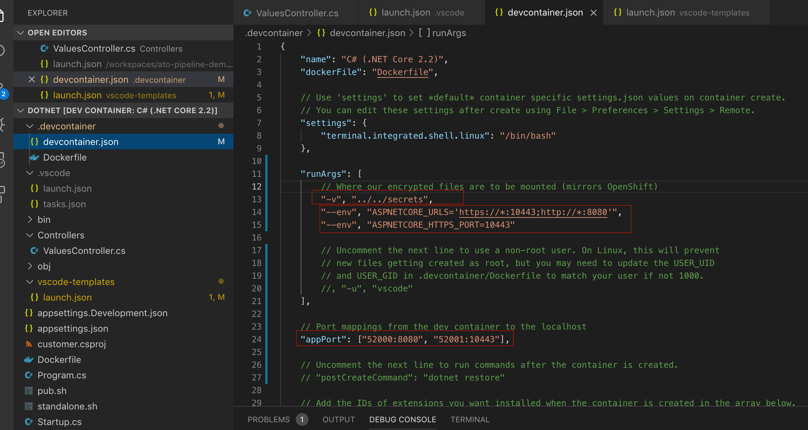
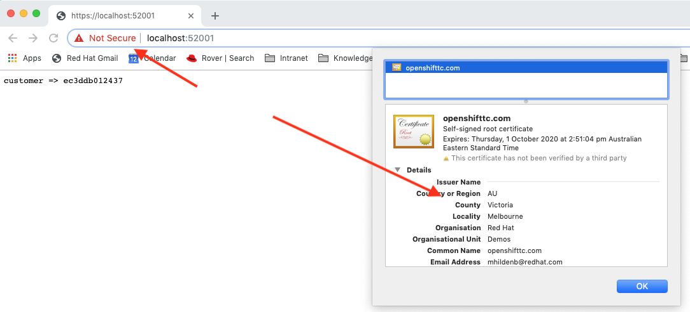
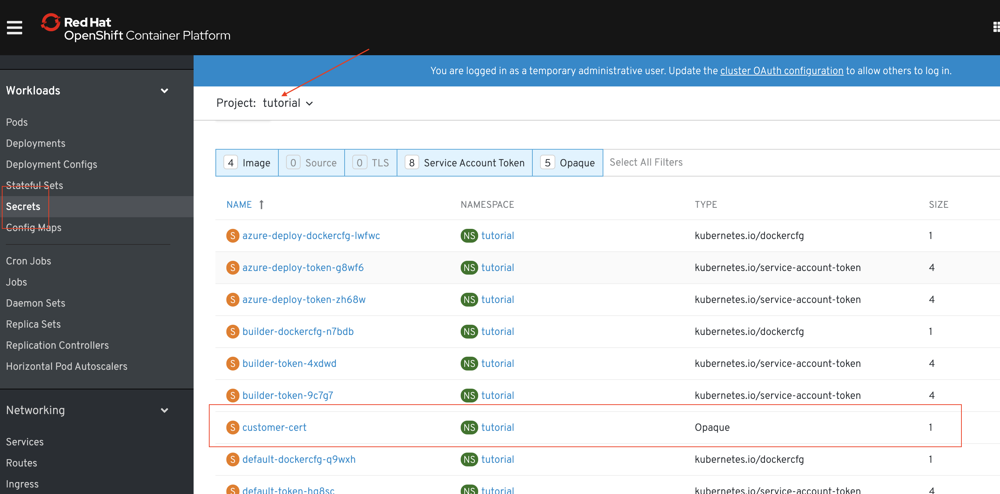
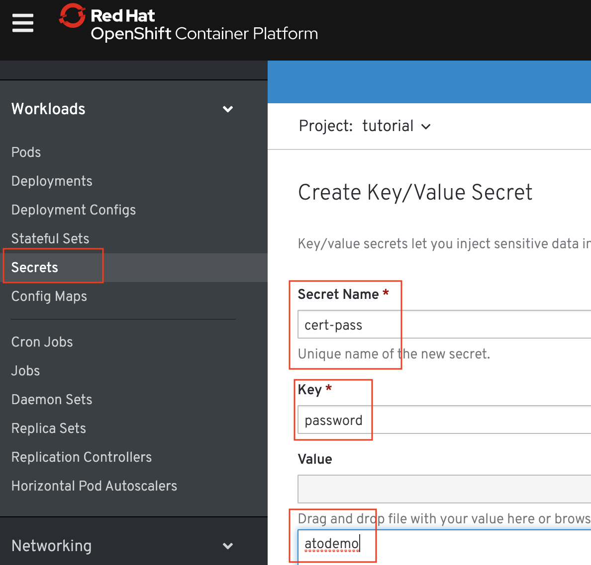
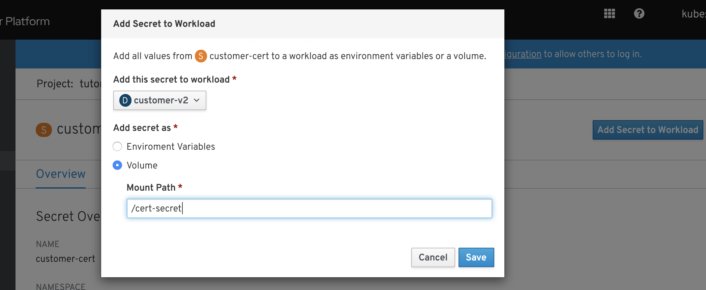
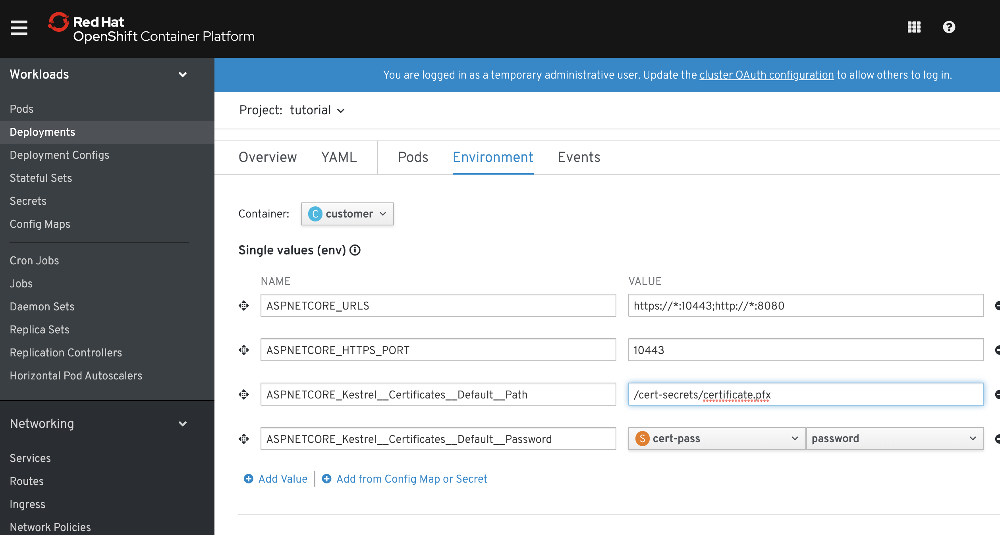
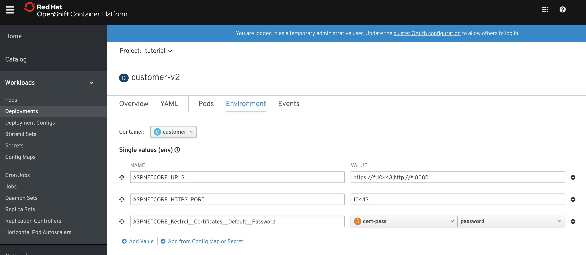

= Secrets and SSL
include::includes/common.adoc[]

Pre-req

----
# Project should be installed

# Service Mesh should be installed

# Real Recommendation v2 should be running

# Container v2 project should exist (and be deployed)

# azure pipeline demo should be cloned and downloaded
----

== Scenario

Now that pod is deployed, we'd like to route traffic to our pod (in HTTP)

----
cdt
cat kube/customer/virtual-service-customer-v1_and_v2.yml

oc apply -f kube/customer/virtual-service-customer-v1_and_v2.yml
----

* Notice that v2 deployment starts coming through

We would like to to install the following certificate to our dotnet customer pod:

Some requirements:

* This certificate needs to be served by the pod itself
** _(meant to broadly mirror ATO workflows)_
* The cert will be served by the container (_Kestrel Server_) itself 
* The certificate private key must stay protected

== Testing SSL Locally on the container

We have created a pfx file (pkcs 12 format) with the private a public key for our (self-signed) certificate that we'd like the kestrel server to serve.

* The _Kestrel_ server is driven by the following properties

.Kestrel SSL Properties
|===
|Property|Value|Description

|ASPNETCORE_URLS
|"https://\*:10443;http://*:8080"
|URLs matches for service of HTTPS and HTTP

|ASPNETCORE_HTTPS_PORT
|10443
|Port that the kestrel server will listen for HTTPS

|ASPNETCORE_Kestrel\__Certificates__Default__Path
|/cert-secret/certificate.pfx
|Location to the (password protected) public and private key.  This file is to be kept [.underline]#secret#

|ASPNETCORE_Kestrel\__Certificates__Default__Password
|\***
|[.underline]#secret# that is the password to open the pfx file with the TLS private and public key
|===

* Let's see how we can set that up in a our dev environment
----
cd ~/Downloads/demo/ato-pipeline-demo
cd customer/dotnet
code .
----

* Select Open In Container when prompted

* First, let's take a closer look at the launch.conf
** CMD+P launch.json (open the one in the templates directory)

NOTE: launch.json is generally _not_ checked into source control (.gitignore) so any sensitive secrets/passwords should be safe to put in there.

* And the _devcontainer.json_

NOTE: The secrets mount point is assumed to be outside of source control as real secrets should not be kept there.

* Ensure that you are using the templated launch.json
----
cd ~/Downloads/demo/ato-pipeline-demo/customer/dotnet
cp -f vscode-templates/launch.json .vscode/launch.json
----

* Set a breakpoint in the ValuesController
** `{public string Get()}`

* Use the *.NET Core Launch (web with SSL support)* launch configuration

* When process running navigate to (CMD clicking) link:http://localhost:52000[localhost http] and link:https://localhost:52001[localhost https]
** Notice the cert details on localhost https

== Install Secrets in OpenShift

* First let's put the pfx in Secret storage in OpenShift

----
cdt
oc create secret generic customer-cert --from-file=secrets/certificate.pfx 
----

* Show the secret in OpenShift

* Now create a secret to represent the password to the pfx file
** Select *Key/Value Secret*
** Enter according to the following

.Secret Fields
|===
|Field|Value

|Secret Name|cert-pass
|Key|Password
|Value|atodemo
|===

== Update Container v2 Deployment

Let's install the secrets through the UI.  We'll start with the pfx file

* Add the certificate file as a volume secret
** Click on "customer-cert"
** Select *Add Secret to Workload* from the top right
** Fill in per table and click Save

* Navigate link:https://console-openshift-console.apps.ato-demo-replica.openshifttc.com/k8s/ns/tutorial/deployments/customer-v2/environment[here] and enter the fields per this table:

.Customer Environment Properties
|===
|Property|Value

|ASPNETCORE_URLS
|https://\*:10443;http://*:8080

|ASPNETCORE_HTTPS_PORT
|10443
|===

* Now we enter the fields backed by secrets

.Customer Secret Environment Properties
|===
|Property|Instructions

|ASPNETCORE_Kestrel\__Certificates__Default__Password
|

* add "from config map or secret"

* select customer-cert

* select certificate.pfx

|ASPNETCORE_Kestrel\__Certificates__Default__Path
| _not technically a secret, this is based on the secret cert's mount point_

* enter "/cert-secret*s*/certificate.pfx"

WARNING: We're going to intentionally put the secrets at the wrong mount point

|===

* Open up a testing SSL Service and route
----
cdt
oc apply -f kube/customer/Service-v2-ssl.yml
oc apply -f kube/customer/Route-ssl.yml

# NOTE: route-ssl may have a specific host in it that should be changed
# Turn off Istio Lockdown
oc delete -f scripts/network-policy.yaml
----

* Attempt to hit link:https://customer-tutorial-ssl.apps.ato-demo-replica.openshifttc.com[the route] 
** It fails :(

[.underline]#Next# some remote debugging to find out what's going wrong