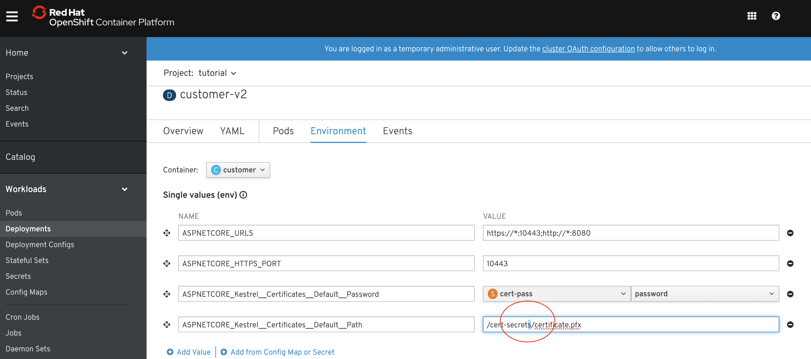
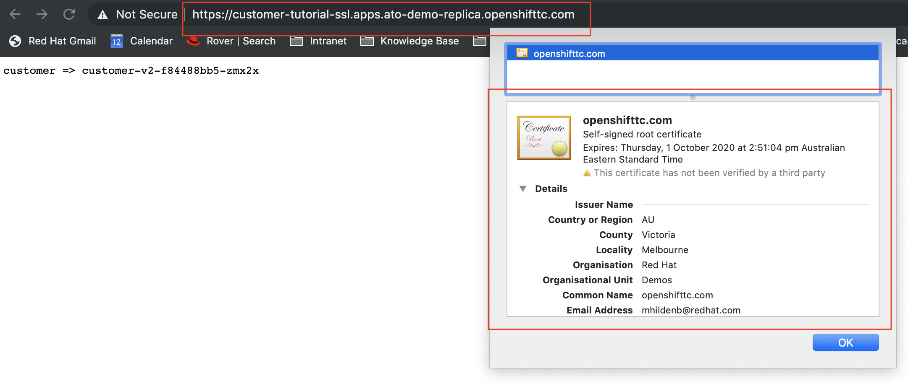

= Advanced Troubleshooting
include::includes/common.adoc[]

Pre-req

----
# Project should be installed

# Service Mesh should be installed

# Real Recommendation v2 should be running

# Container v2 project should exist (and be deployed)

# azure pipeline demo should be cloned and downloaded

# Environment variables and secrets for customer v2 should be setup (incorrectly) based on 07
cdt
oc apply -f kube/customer/Service-v2-ssl.yml
oc apply -f kube/customer/Route-ssl.yml

# NOTE: route-ssl may have a specific host in it that should be changed
# Turn off Istio Lockdown
oc delete -f scripts/network-policy.yaml
oc apply -f kube/customer/Deployment-v2-ssl-buggy.yml
----

== Stop the crashing

Notice that our pod has not come up and that it is reporting that there is "no healthy upstream".  Let's troubleshoot

* _Shell_: Use logging commands
** Open a new shell and run the following
----
oc logs $(oc get pods | grep customer-v2 | awk {'print $1'}) -c customer -f

----

* Logs will report this error
----
crit: Microsoft.AspNetCore.Server.Kestrel[0]
      Unable to start Kestrel.
Interop+Crypto+OpenSslCryptographicException: error:2006D080:BIO routines:BIO_new_file:no such file
   at Interop.Crypto.CheckValidOpenSslHandle(SafeHandle handle)
   at Internal.Cryptography.Pal.CertificatePal.FromFile(String fileName, SafePasswordHandle password, X509KeyStorageFlags keyStorageFlags)
   at System.Security.Cryptography.X509Certificates.X509Certificate..ctor(String fileName, String password, X509KeyStorageFlags keyStorageFlags)
   at Microsoft.AspNetCore.Server.Kestrel.KestrelConfigurationLoader.LoadCertificate(CertificateConfig certInfo, String endpointName)
   at Microsoft.AspNetCore.Server.Kestrel.KestrelConfigurationLoader.LoadDefaultCert(ConfigurationReader configReader)
   at Microsoft.AspNetCore.Server.Kestrel.KestrelConfigurationLoader.Load()
   at Microsoft.AspNetCore.Server.Kestrel.Core.KestrelServer.ValidateOptions()
....
   
   at Microsoft.AspNetCore.Hosting.WebHostExtensions.RunAsync(IWebHost host, CancellationToken token)
----

* Let's start a debug pod

----
oc debug $(oc get pods | grep customer-v2 | awk {'print $1'})
----
----
Defaulting container name to customer.
Use 'oc describe pod/customer-v2-8575f8b976-5gmdq-debug -n tutorial' to see all of the containers in this pod.

Starting pod/customer-v2-8575f8b976-5gmdq-debug ...
If you don't see a command prompt, try pressing enter.
sh-4.2$ 
----

* Run this command in the pod

----
cd /app
scl enable rh-dotnet22 -- dotnet customer.dll
----

== Debug the Debug pod

* Update the launch config

WARNING: The token replacement doesn't currently work property for the omnisharp extension, thus we're going to have to fill in the podname part of the launch.conf

----
cd ~/Downloads/demo/ato-pipeline-demo/customer/dotnet/
cat .vscode/launch.json

# FIXME: Run sed to substitute ${input:podName}
POD=$(oc get pods | grep "\-debug" | awk {'print $1'})
eval "sed 's/\\\${input:podName}/$POD/'" .vscode/launch.json > out.json && mv out.json .vscode/launch.json 

code .
----

* The executable has been setup to wait for the debugger in a debug pod so that it doesn't hit the crash

Let's look at this in the debugger

== Attach the dotnet core debugger

* Open VSCode

* Set breakpoints at:
** Program.cs ::Main
** [optional] Startup::Startup

* Run the configuration

* Once attached:
** In the debug console put this:

----
Environment.GetEnvironmentVariable("ASPNETCORE_Kestrel__Certificates__Default__Path")
----

Which will show that the path is incorrect to the file

* Update the environment variable in the deployment and redeploy.

== Global SSL

* Once the pod comes back up, follow the link:https://customer-tutorial-ssl.apps.ato-demo-replica.openshifttc.com[SSL route]

* Show the new cert

