:experimental:
:toc:
:toc-levels: 4

= Service Mesh Demo 2019

include:includes/common.adoc[]

[Pre-requisites]
====
Make sure to follow the setup instructions in the link:../readme.adoc[readme.adoc]

====

Window Setup: Visible
====
1. A shell for running the load script continuously
2. A shell for running one off commands 
3. VSCode opened to the service mesh project for showing certain yaml files with highlighting
----
cd $DEMO_HOME
code .
----
3. *IMPORTANT:* A browser with tabs for Kiali, Jaeger, endpoints, and link:file:walkthrough/meetup.adoc[this script]
** If you don't have Jaeger and Kiali open then you haven't accepted the cert and it can cause other parts of the demo to fail
4. VSCode with the Java Project
====

== Run a build locally

. Let's create a springboot application in a container
+
----
cd $DEMO_HOME/recommendation/java/springboot
code .
----
+
.At the prompt, select "Reopen in container".  Show the Dockerfile in the .devcontainer directory and point out that nothing is installed locally

. Within a bash shell in the container, run the following commands (assuming that `demo-app` is the name of the project that your services were deployed to)
+
----
export DEMO_HOME=$(pwd)
oc project demo-app
mvn clean install -DskipTests
----
+
. When the build has completed, then we want to update the recommendation to return a special message that we'll come back to later.  Use Cmd+P to quickly open the *RecommendationController.java* file.  You want to edit the following line.
+
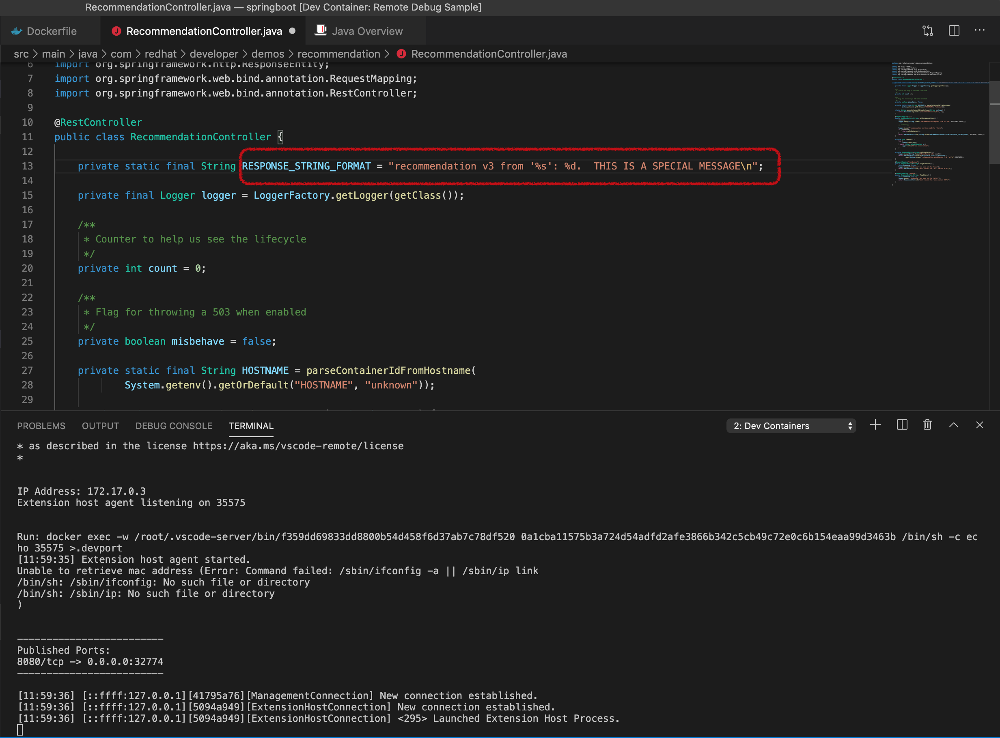
+
** You may want that message to come from the audience.
+
. Once the edit is complete, rebuild and run locally with the command
+
----
java -Xdebug -Xrunjdwp:transport=dt_socket,address=5000,server=y,suspend=n -jar target/recommendation.jar
----
+
** [blue]#Or better, you can debug with the launch.conf.  If not already available, you can try:#
+
----
cp -f templates/vscode/* .vscode/
----
+
. Then you should be able to debug the application by going to the debug tab and pressing the green triangle next as in the picture
+
image:images/debug-locally.png[]
+
. Open the Remote extension sidebar and scroll to the bottom to see the forwarded ports display.  Click the **+** next to the 8080 port.
+
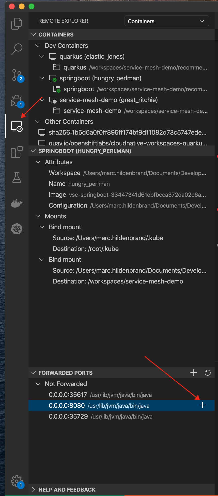
+
. Then open with localhost to the forwarded container by either going to localhost:8080 in a browser or clicking the little world icon next to the port
+
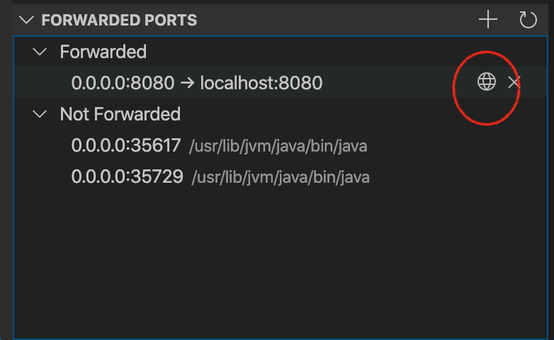
+
. This should break into the debugger (if you set a breakpoint)

== Remote Building to Kubernetes

[NOTE]
.Important Prerequisites
====
Make sure you have setup up to step three in the *pre-requisites* before you attempt to add this deployment

[red]#DON'T FORGET TO LOGIN TO OPENSHIFT#
====

. From the vscode shell, run the following command to create a new build and start one
+
----
oc new-build --name recommendation-v3 java:8 --binary -l app=recommendation,version=v3 -n demo-app
oc start-build recommendation-v3 --from-file target/*.jar --follow -n demo-app
----
+
** Explain that this is building within the java container and installing our binary (that we made locally) within it.  Explain that there is S2I built into OpenShift to allow integration with a git repo.
+
. Once the build is complete, create a new app for our binary including labels that should be applied (this is important for routing to this pod later on in the walkthrough)
+
NOTE: As per the instructions link:https://docs.openshift.com/container-platform/4.4/service_mesh/service_mesh_day_two/prepare-to-deploy-applications-ossm.html#ossm-automatic-sidecar-injection_deploying-applications-ossm[here] you need to explicitly request that your application have sidecar injection applied to it.  We do this with an annotation.
+
----
oc new-app recommendation-v3 -l app=recommendation,version=v3,app.kubernetes.io/part-of=Recommendation -e JAVA_OPTS="-Xdebug -Xrunjdwp:transport=dt_socket,address=5000,server=y,suspend=n"

# Update the template of the deployment config to ensure that recommendation-v3 pods get a sidecar injected
oc patch dc/recommendation-v3 --patch '{"spec":{"template":{"metadata":{"annotations": { "sidecar.istio.io/inject":"true" }}}}}'

oc expose svc recommendation-v3
----
+
**The JAVA_OPTS will ensure that the target pod will run with debugging
+
. Go to the openshift console and show our new recommendation service running.  To get the route use:
+
----
echo "http://$(oc get route recommendation-v3 -o jsonpath='{.spec.host}' -n demo-app)/" 
----
+
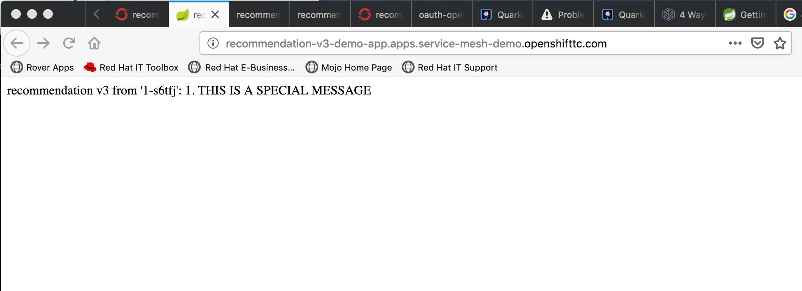

== Runtime Complexity

Our toy app has some problems out of the gate.  Let's run calls to it in a window and then use the ability to visualize the service mesh to pick apart what's going on

. In a shell window where you are logged into the OpenShift cluster, run the following
+
----
$DEMO_HOME/scripts/project-load-gen.sh customer --istio

Starting load gen for istio-ingressgateway-istio-system.apps.service-mesh.openshifttc.com/customer.  Proceed? (y/N)
----
+
. Observe the output
+
----
customer => Error: 503 - preference => 503 recommendation misbehavior from '67c49fb99b-9d6tf'

Customer customer-v2-66bd8ffc8d-w9sfr => unknown
customer => Error: 503 - preference => 503 recommendation misbehavior from '67c49fb99b-9d6tf'

customer => Error: 503 - preference => 503 recommendation misbehavior from '67c49fb99b-9d6tf'

Customer customer-v2-66bd8ffc8d-w9sfr => recommendation v1 from '69d8cd757c-qr6hn': 4618

customer => Error: 503 - preference => 503 recommendation misbehavior from '67c49fb99b-9d6tf'

Customer customer-v2-66bd8ffc8d-w9sfr => unknown
customer => preference => recommendation v1 from '69d8cd757c-qr6hn': 4619
customer => Error: 503 - preference => 503 recommendation misbehavior from '67c49fb99b-9d6tf'

customer => preference => recommendation v1 from '69d8cd757c-qr6hn': 4620
customer => preference => recommendation v1 from '69d8cd757c-qr6hn': 4621
Customer customer-v2-66bd8ffc8d-w9sfr => recommendation v1 from '69d8cd757c-qr6hn': 4622

Customer customer-v2-66bd8ffc8d-w9sfr => recommendation v1 from '69d8cd757c-qr6hn': 4623

customer => preference => recommendation v1 from '69d8cd757c-qr6hn': 4624
Customer customer-v2-66bd8ffc8d-w9sfr => unknown
----
+
. Open link:https://kiali-istio-system.apps.service-mesh-demo.openshifttc.com/console/graph/namespaces/?edges=noEdgeLabels&graphType=versionedApp&namespaces=demo-app&unusedNodes=true&injectServiceNodes=true&duration=60&pi=10000&layout=dagre[Kiali], and make sure to open the project as seen here
+
[NOTE]
.Get Kiali Host
====
You can get the kiali host by issuing this command
----
echo "https://$(oc get route kiali -o=jsonpath='{.spec.host}' -n demo-app-istio-system)/"
----

Or you can use istioctl to open up a port forward
----
istioctl d kiali -i demo-app-istio-system
----
====
+
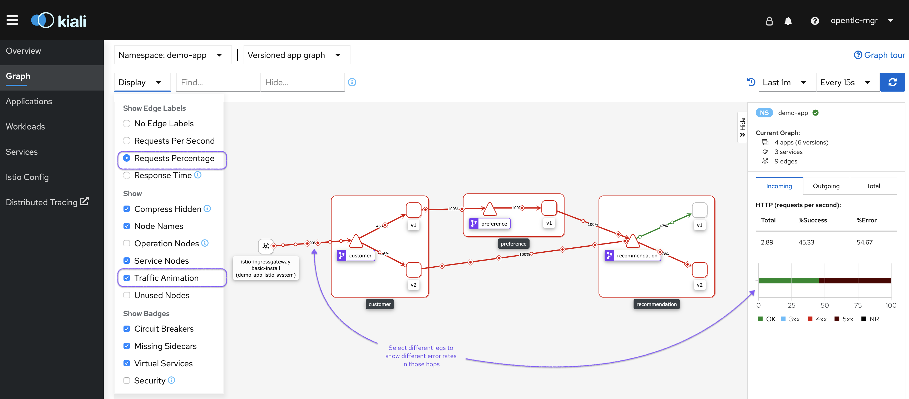
+
. Open link:https://jaeger-istio-system.apps.service-mesh-demo.openshifttc.com/search?end=1574598630733000&limit=20&lookback=1h&maxDuration&minDuration&service=recommendation&start=1574595030733000[Jaeger Trace] to inspect some of the items with failures.  
+
[NOTE]
.Get Jaeger Host
====
You can get the jaeger host by issuing this command
----
echo "https://$(oc get route jaeger -o=jsonpath='{.spec.host}' -n demo-app-istio-system)/"
----

Or you can use istioctl to open up a port forward
----
istioctl d jaeger -i demo-app-istio-system
----
====
+
. Put *"recommendation"* in the search box to get traces that end with it
** NOTE: it is possible to do this through Kiali as well, using the "Distributed Tracing" tab
image:images/jaeger-trace.png[]
+
OPTIONAL:
====
Show the link:https://kiali-istio-system.apps.service-mesh.openshifttc.com/console/istio?namespaces=demo-app[Istio Configuration from kiali] and reinforce the concepts of Gateways, VirtualServices, and Destination Rules.
====
 
== Resilence

=== Dark Release

The recommendation service v2 is failing.  Let's pull it out of production and instead mirror traffic that comes into it so that we might be able to figure out what's going on.

. From within VSCode, use kbd:[CMD+P] to quickly open the link:istiofiles/virtual-service-recommendation-v1-mirror-v2.yml[istiofiles/virtual-service-recommendation-v1-mirror-v2.yml] yaml for inspection:
+
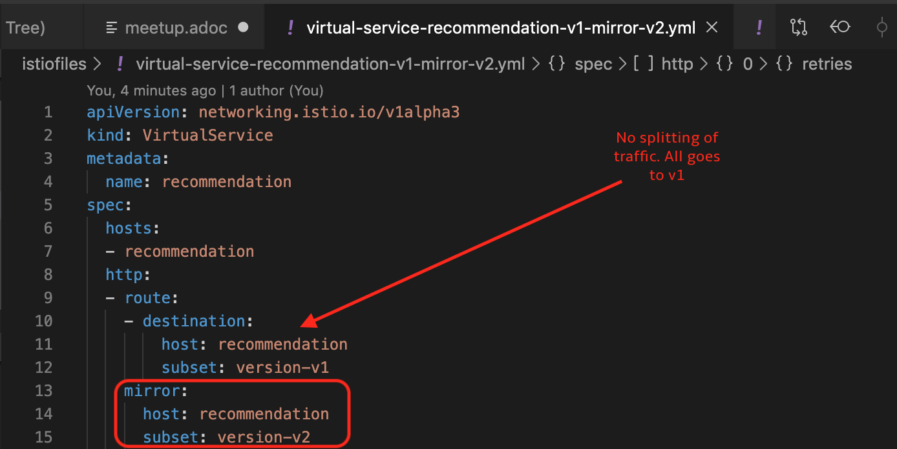
+
. Apply the changes to the cluster
+
----
oc apply -f $DEMO_HOME/istiofiles/virtual-service-recommendation-v1-mirror-v2.yml
virtualservice.networking.istio.io/recommendation configured
----
+
. Go to the continous invocation shell and notice errors going to 0
+
. Open link:https://kiali-istio-system.apps.service-mesh.openshifttc.com/console/graph/namespaces/?edges=requestsPercentage&graphType=versionedApp&namespaces=demo-app&unusedNodes=true&injectServiceNodes=true&duration=60&pi=15000&layout=dagre[Kiali] and notice that error rate has gone to 0.
+
----
echo "https://$(oc get route kiali -o=jsonpath='{.spec.host}' -n demo-app-istio-system)/"
----
+
. To see the actual mirrored calls, we need to look to link:https://jaeger-istio-system.apps.service-mesh.openshifttc.com/search?end=1573388314241000&limit=20&lookback=1h&maxDuration&minDuration&service=recommendation&start=1573384714241000[Jaeger] searching again for *recommendation*
+
----
istioctl d jaeger -i demo-app-istio-system
----
+
image:images/jaeger-dark-release.png[]

=== Remote Debugging

Let's connect to the remote service using VSCode to try to figure out what's going on 

[WARNING]
====
[red]#If your connection is slow, the remote debugger might take a long time to connect and step through the code#
====

. First, be sure to stop any loadgen
. Open VSCode for the recommendation sub-project by going here:
+
----
$DEMO_HOME/recommendation/java/quarkus/
code .
----
+
.Select *Open Folder in Container*
+
image::images/vscode_initialopen.png[]
+
* Show the development container: *Dockerfile*
** point out maven
** sdk
* Show *.devcontainer.json*
** show the kubernetes and java plugins
** show the args for the volume mount to get to user's home directory
** Spoiler: and the environment variable!
+
. Open the RecommendationResource.java and set breakpoint to: 
** public Response getRecommendations()
+
. Open Kubernetes extension
** Select cluster
** Select namespaces (ensure *demo-app* is selected)
** Select Workloads
** Select Pods
+
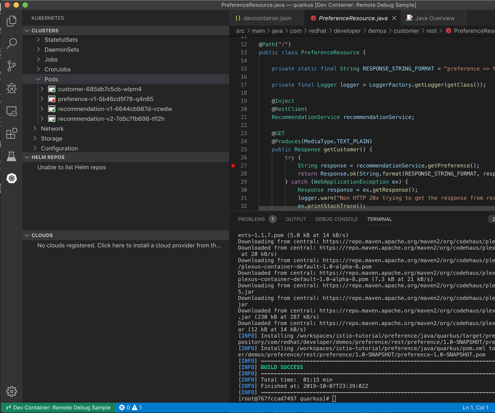
+
. Find the Recommendation-v2 pod, right click and select attach
** Select Java
** Select the recommendation container (and not the side car)

==== Hitting the breakpoint and fixing

. Assuming loadgen has been stopped, make a single call to the endpoint
+
----
$DEMO_HOME/scripts/project-load-gen.sh customer --istio
Continuous load gen for istio-ingressgateway-istio-system.apps.cluster-bne-d92d.bne-d92d.example.opentlc.com/customer?  Press Y to proceed and N for single call (y/N)

Calling endpoint once
customer => preference => recommendation v1 from '69d8cd757c-rqkj6': 1833
----
+
. Wait until breakpoint is hit
** show count in watch window
** Might be a little bit slow
+
[INFO]
.Signs that the debugger is attaching
====
If the debugger connection is slow, you can show that the connection has been made by going to the debug panel and looking at the threads
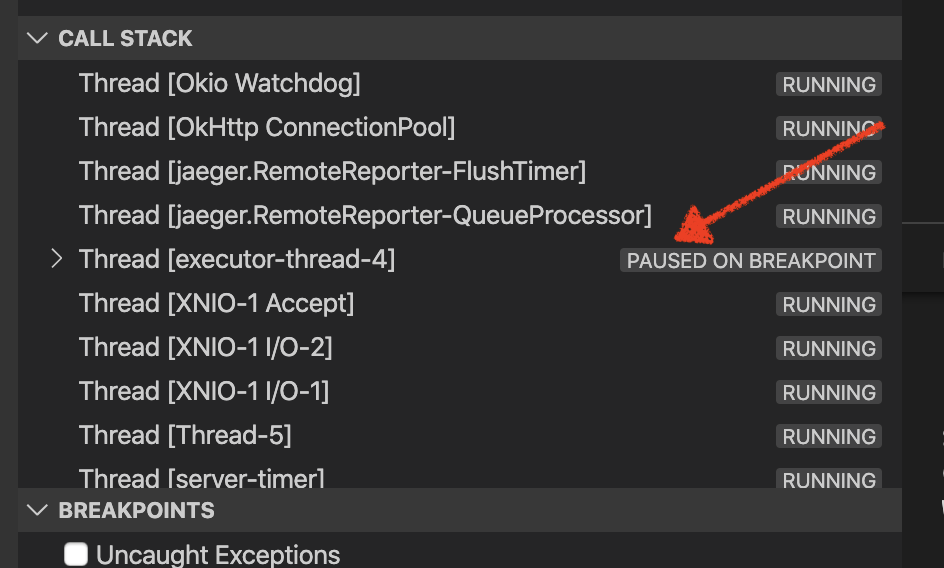
====
+
. Walk through where the error is
** search for where 'misbehave' is set
** Notice it's from an ENVIRONMENT Variable

NOTE: If you don't want to show the code being fixed and recompiled then jump to <<Meanwhile: Quick fix in production,Production fix>>

===== Option 1: Hot Swap Code to test
. Allow the debugger to continue execution

. Change the default from "true" to "false" and save the file

. Click the hotswap button, notice that the class begins transmit
+
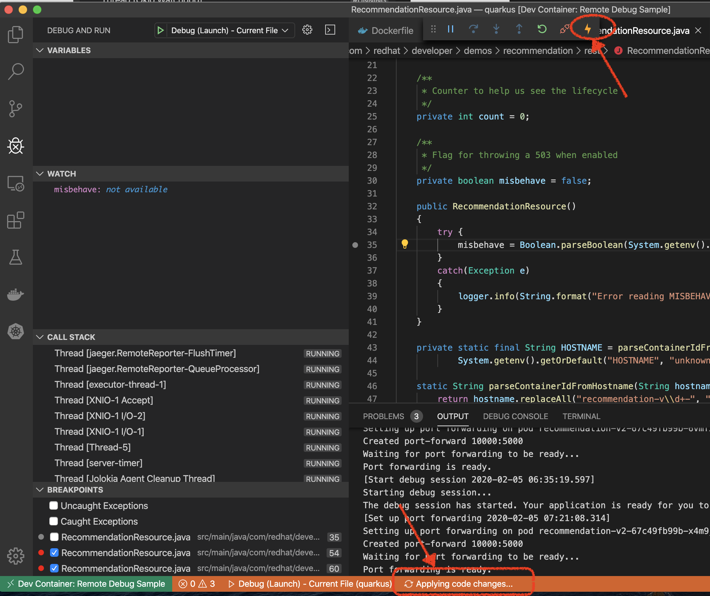
+
. [red]#Set a breakpoint at the end of the function to prove that this return can now get hit#

. Submit another request to the endpoint after the upload of the class is done.
+
----
$DEMO_HOME/scripts/project-load-gen.sh customer --istio
----
+
. Show that the end return endpoint is now being hit
+
. Open Kiali and show that most recent call doesn't show the endpoint getting hit.
+
. Next, show that this change was ephemeral by stopping the debugger and deleting the pod
+
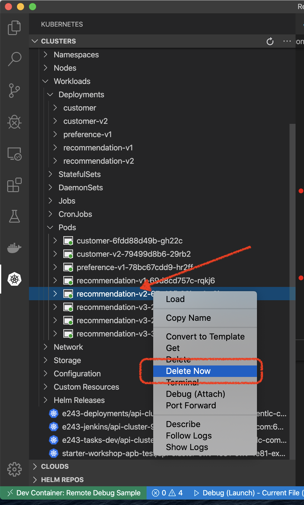
+
. Resubmit a request
+
----
$DEMO_HOME/scripts/project-load-gen.sh customer --istio
----
+
. Show that the error re-appears in Kiali

===== Option 2: Fix, recompile, and upload

[WARNING]
====
This section is unfinished.
====

. Recompile the sources (*in VSCode bash*)
+
----
mvn clean install
----
+
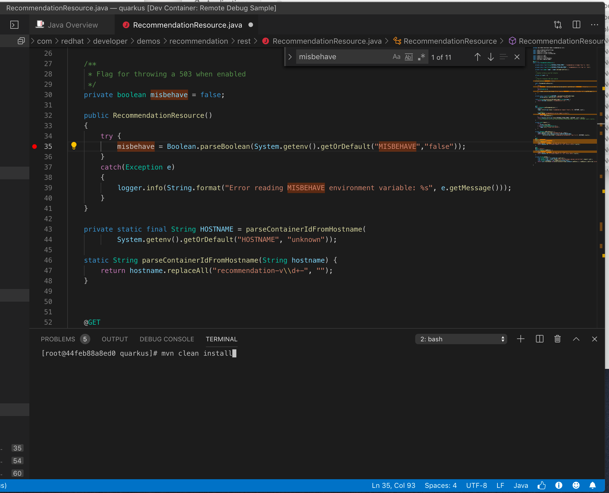
+
. Discuss how this container could now be built
** Show the other Dockerfile that is NOT in .devcontainer

==== Meanwhile: Quick fix in production

Since the problem is with and environment variable, this is something we can change

. Change the Environment Variable
** Can do in OpenShift directly (try this link:https://console-openshift-console.apps.service-mesh.openshifttc.com/k8s/ns/demo-app/deployments/recommendation-v2/environment[link])
+
image::images/Misbehave_False.png[]
+
. Add the new "MISBEHAVE" environment variable and set to *false*
. Hit save.  
+
[NOTE]
.Setting the environment variable in the deployment instead
====
----
oc set env deployment/recommendation-v2 MISBEHAVE="false"
----
====
+
. _Notice that pod is destroyed and recreated_
+
. Restart loadgen if necessary
+
----
$DEMO_HOME/scripts/project-load-gen.sh customer --istio                                                        Continuous load gen for istio-ingressgateway-istio-system.apps.cluster-bne-d92d.bne-d92d.example.opentlc.com/customer?  Press Y to proceed and N for single call (y/N)y
----
+
. Check Jaeger
+
----
# Allow istioctl to setup port forwarding for us and we connect on localhost
istioctl d jaeger -i demo-app-istio-system

# OR you can get it the oldfashioned way
echo "https://$(oc get route jaeger -o=jsonpath='{.spec.host}' -n demo-app-istio-system)/"
----
+
** Notice no errors
** Hit "Find Traces" multiple times to see if there's any change

==== Reinstating the service

Next we'll slowly return live traffic to the recommendation endpoint.

. Return to the VSCode instance that you opened at the root of the demo and restart loadgen
+
----
$DEMO_HOME/scripts/project-load-gen.sh customer --istio
----
+
. Use kbd:[CMD+P] to navigate quickly to this file link:istiofiles/virtual-service-recommendation-v1_and_v2_75_25.yml[virtual-service-recommendation-v1_and_v2_75_25.yml]
+
image:images/virtual-service-75-25.png[]
+
. apply this file to the cluster
+
----
kubectl apply -f $DEMO_HOME/istiofiles/virtual-service-recommendation-v1_and_v2_75_25.yml

virtualservice.networking.istio.io/recommendation configured
----
+
. Use `istioctl` to show how the route has been updated
+
----
istioctl x des service recommendation -i demo-app-istio-system

Service: recommendation
   Port: http 8080/HTTP targets pod port 8080
DestinationRule: recommendation for "recommendation"
   Matching subsets: version-v1,version-v2
   No Traffic Policy
Pod is PERMISSIVE (enforces HTTP/mTLS) and clients speak HTTP
VirtualService: recommendation
   Weight 75%
   Weight 25%
----
+
. Go back to link:https://kiali-istio-system.apps.service-mesh.openshifttc.com/console/graph/namespaces/?edges=requestsPercentage&graphType=versionedApp&namespaces=demo-app&unusedNodes=true&injectServiceNodes=true&duration=60&pi=15000&layout=dagre[Kiali] and show the traffic showing up
** Over time the call rate should approach 75/25
+
image:images/kiali-recommendation-75-25.png[]

== Security

[red]#NOTE: As of ServiceMesh 1.1.1 this no longer works#

Let's pretend that we discover that the customer service should never be calling the recommendation service directly.  We can enforce this by setting up access rules that ensure a given path through the system

. In VSCode, use kbd:[CMD+p] and start searching for _acl-deny-except-customer2preference2recommendation.yml_.  Let's take a look at the file and highlight the areas below:
+
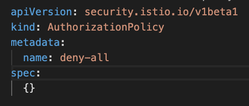
+
. Now apply the changes to the mesh
+
----
kubectl apply -f $DEMO_HOME/istiofiles/acl-deny-except-customer2preference2recommendation.yml 
----
+
. Errors should start to mount.  [red]#NOTE: It can take 30 seconds or more for policy to propagate through the mesh#
+
. Once errors start appearing in the load test, you can look deeper in Jaeger by searching for *istio-mixer*
+
image:images/jaeger-denier.png[]
+
[OPTIONAL]
.Remove the restriction
====
You can remove the acl easily by deleting the istiofiles like so
----
kubectl delete -f istiofiles/acl-deny-except-customer2preference2recommendation.yml

denier.config.istio.io "do-not-pass-go" deleted
checknothing.config.istio.io "just-stop" deleted
rule.config.istio.io "no-customer-to-recommendation" deleted
rule.config.istio.io "no-preference-to-customer" deleted
rule.config.istio.io "no-recommendation-to-customer" deleted
rule.config.istio.io "no-recommendation-to-preference" deleted
----
====
+
. To get rid of the offending customer service, navigate (using kbd:[CMD+p]) to start searching for _virtual-service-customer-v1_only.yml_.  
** Point out what the file is doing
. Now apply the changes
+
----
kubectl apply -f $DEMO_HOME/kube/customer/virtual-service-customer-v1_only.yml
----
+
. Go back to Kiali.  The errors should stop

== Other Opportunities: Route based on Headers

Special message for some

NOTE: This is demonstrated best when all traffic is routed only to v1 of the customer

. In VSCode use kbd:[CMD+P] to quickly open _virtual-service-recommendation-header.yml_

. Review the file and then apply it to the cluster
+
----
oc apply -f $DEMO_HOME/istiofiles/virtual-service-recommendation-header.yml
----
+
. [blue]#OPTIONAL:# Now you can show the audience what has just been setup using istioctl
+
----
istioctl x describe pod -i demo-app-istio-system $(oc get pods | grep -i recommendation-v3 | grep Running | awk '{print $1}')
----
+
** Successful output will look like this (if output doesn't match, then look to <<Debugging with Istioctl,Troubleshooting>> section)
+
----
Pod: recommendation-v3-3-k5h42
   Pod Ports: 8080 (recommendation-v3), 8443 (recommendation-v3), 8778 (recommendation-v3), 15090 (istio-proxy)
--------------------
Service: recommendation
   Port: http 8080/HTTP targets pod port 8080
DestinationRule: recommendation for "recommendation"
   Matching subsets: version-v3
      (Non-matching subsets version-v1,version-v2)
   No Traffic Policy
Pod is PERMISSIVE (enforces HTTP/mTLS) and clients speak HTTP
VirtualService: recommendation
   when headers are baggage-user-agent=regex:".*iPhone OS.*"
   1 additional destination(s) that will not reach this pod
----
+
.A slightly less useful version of the above command
====
You can also query at the service level to look at the overall service instead of what requests will be reaching the pod

----
istioctl x describe svc recommendation -i demo-app-istio-system
----
Generates this (slightly confusing) output:
----
Service: recommendation
   Port: http 8080/HTTP targets pod port 8080
DestinationRule: recommendation for "recommendation"
   Matching subsets: version-v1,version-v2,version-v3
   No Traffic Policy
Pod is PERMISSIVE, client protocol unspecified
VirtualService: recommendation
   when headers are baggage-user-agent=regex:".*iPhone OS.*"
   Weight 50%
   Weight 50%
----
====
+
. Issue a command with a non-compatible user agent
+
----
$DEMO_HOME/scripts/project-load-gen.sh customer --istio -h "User-Agent: Pretend Android"
----
+
. Notice that there is no change in what's returned.
. Now attempt to start load with a suitable user-agent
+
----
$DEMO_HOME/scripts/project-load-gen.sh customer --istio -h "User-Agent: Pretend iPhone OS Test"
----
+
** You should see Recommendation-v3 returned

=== For Live Shows

. Ask the audience to navigate to this url: http://bit.ly/petalks
** OR alternatively can use the QR Code

image:images/test-web.png[]

== Troubleshooting

=== Debugging with Istioctl

You can look up route information by using the following command (where _recommendation-v3-5-jsxm9_ is the podname to which you want determine routes).  This output shows that there are none
----
istioctl x describe pod -i demo-app-istio-system recommendation-v3-5-jsxm9

Pod: recommendation-v3-5-jsxm9
   Pod Ports: 8443 (recommendation-v3), 8778 (recommendation-v3), 8080 (recommendation-v3), 15090 (istio-proxy)
Suggestion: add 'version' label to pod for Istio telemetry.
--------------------
Service: recommendation-v3
   Port: 8080-tcp 8080/UnsupportedProtocol targets pod port 8080
   Port: 8443-tcp 8443/UnsupportedProtocol targets pod port 8443
   Port: 8778-tcp 8778/UnsupportedProtocol targets pod port 8778
8080 Pod is PERMISSIVE (enforces HTTP/mTLS) and clients speak HTTP
8443 Pod is PERMISSIVE (enforces HTTP/mTLS) and clients speak HTTP
8778 Pod is PERMISSIVE (enforces HTTP/mTLS) and clients speak HTTP
----
