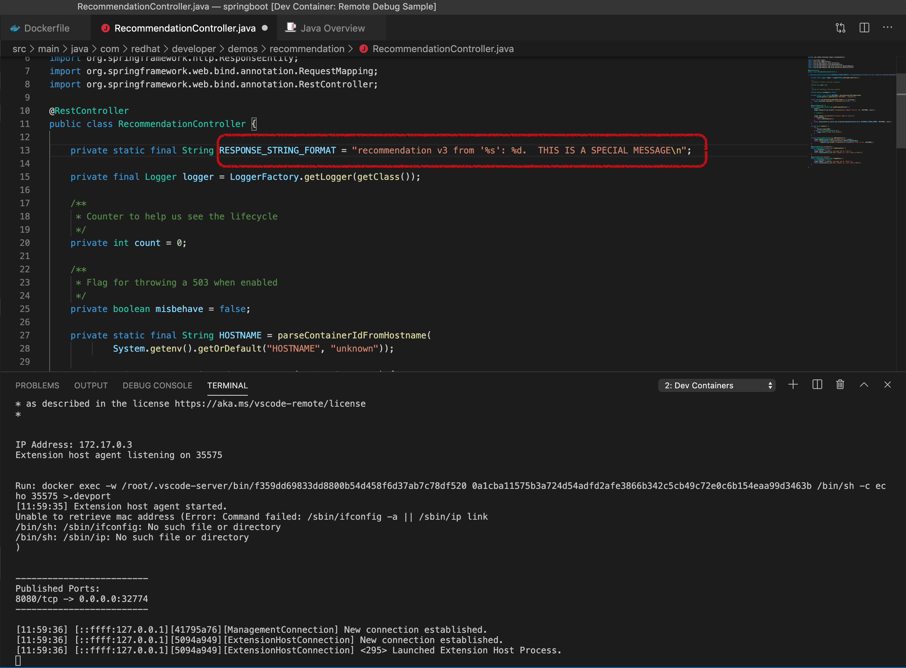
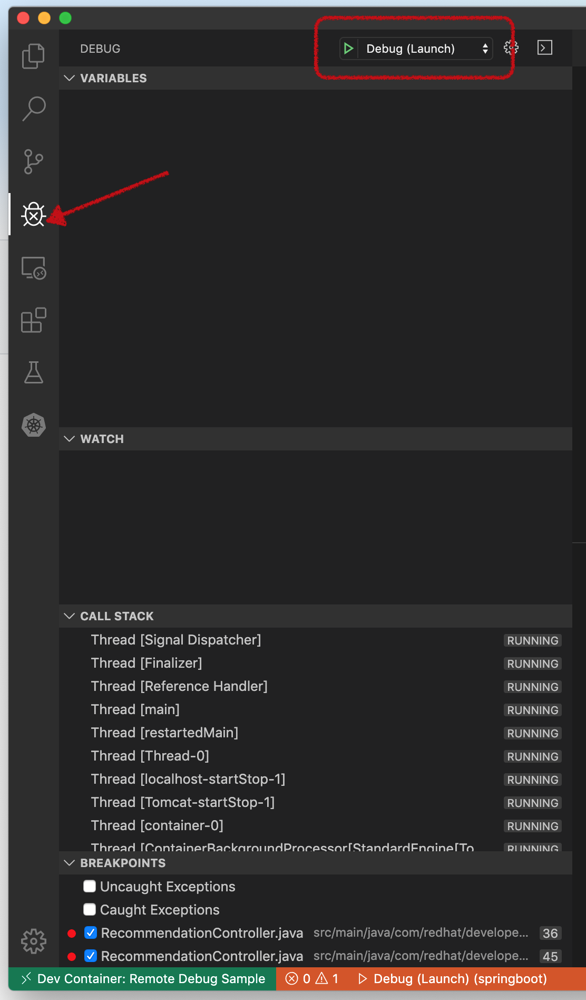
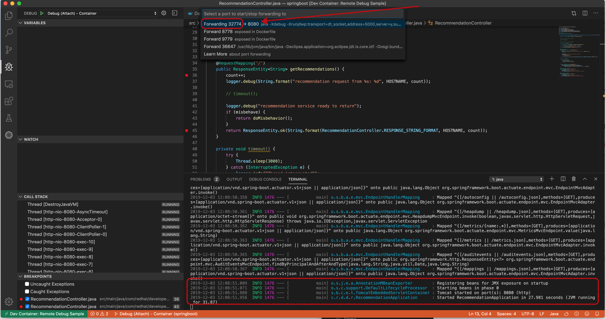
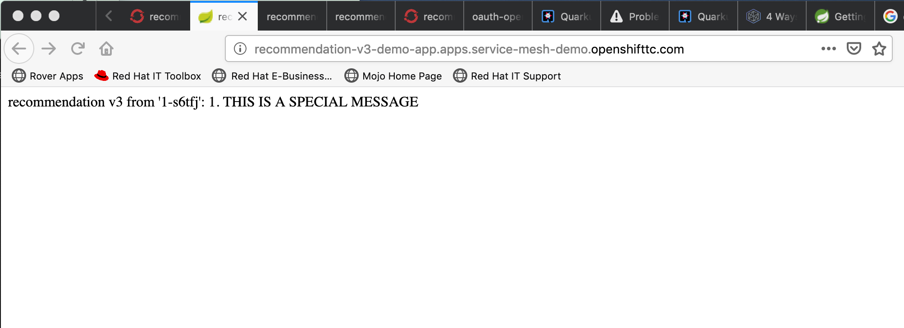
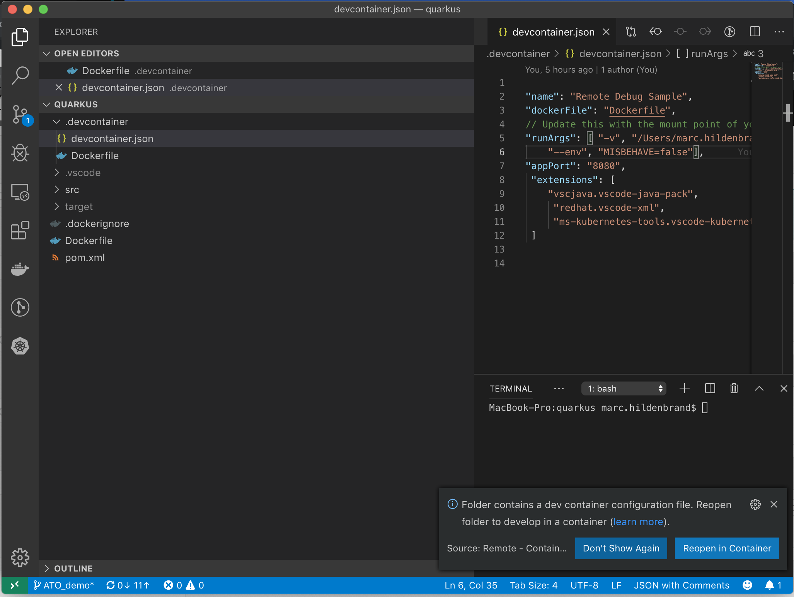

= Service Mesh Demo 2019

include:includes/common.adoc[]

[Pre-requisites]
====
1. Run link:scripts/00-service-mesh-cluster-install.sh[00-service-mesh-cluster-install.sh] to start the install process for service mesh on the cluster
----
$DEMO_HOME/scripts/00-service-mesh-cluster-install.sh
----
* run the following command until you see the corresponding output before you move on to step 2
----
$ watch 'oc get csv -n istio-system -ocustom-columns-file=$DEMO_HOME/istiofiles/install/csv-columns.txt'
NAME                                         VERSION               PHASE
elasticsearch-operator.4.2.5-201911121709   4.2.5-201911121709   Succeeded
jaeger-operator.v1.13.1                     1.13.1               Succeeded
kiali-operator.v1.0.7                       1.0.7                Succeeded
servicemeshoperator.v1.0.2                  1.0.2                Succeeded
----
2. Run link:scripts/01-provision-service-mesh.sh[01-provision-service-mesh.sh] to start up the service mesh control plane (once fully installed)
----
$DEMO_HOME/scripts/01-provision-service-mesh.sh
----
3. Run link:scripts/02-project-no-service-mesh-setup.sh[02-project-no-service-mesh-setup.sh] to create the project with the toy app
----
$DEMO_HOME/scripts/02-project-no-service-mesh-setup.sh
----
3. Run link:scripts/03-project-apply-service-mesh.sh[03-project-apply-service-mesh.sh] to add the toy app to the service mesh
----
$DEMO_HOME/scripts/03-project-apply-service-mesh.sh
----

Make sure the toy app has sidecars installed
====

Window Setup: Visible
====
1. A shell for running the load script continuously
2. A shell for running one off commands 
3. VSCode opened to the service mesh project for showing certain yaml files with highlighting
----
cd $DEMO_HOME
code .
----
3. *IMPORTANT:* A browser with tabs for Kiali, Jaeger, endpoints, and link:file:walkthrough/meetup.adoc[this script]
** If you don't have Jaeger and Kiali open then you haven't accepted the cert and it can cause other parts of the demo to fail
4. VSCode with the Java Project
====

== Run a build locally

Let's create a springboot application in a container

----
$ cd $DEMO_HOME/recommendation/java/springboot
code .
----

At the prompt, select "Reopen in container".  Show the Dockerfile in the .devcontainer directory and point out that nothing is installed locally

Within a bash shell in the container, run the following commands
----
export DEMO_HOME=$(pwd)
mvn clean install -DskipTests
----

When the build has completed, then we want to update the recommendation to return a special message that we'll come back to later.  Use Cmd+P to quickly open the *RecommendationController.java* file.  You want to edit the following line.

You may want that message to come from the audience.

Once the edit is complete, rebuild and run locally with the command

----
java -Xdebug -Xrunjdwp:transport=dt_socket,address=5000,server=y,suspend=n -jar target/recommendation.jar
----

Or better, you can debug with the launch.conf.  If not already available, you can try
----
cp templates/vscode/* .vscode/
cp: overwrite ‘.vscode/launch.json’? y
cp: overwrite ‘.vscode/settings.json’? y
----

Then you should be able to debug the application by going to the debug tab and pressing the green triangle next as in the picture

With Shift+Cmd+P open the command palette and run Forward Ports in container, pick the proper port

Then open with localhost to the forwarded container.

This should break into the debugger (if you set a breakpoint)

== Remote Building to Kubernetes

[NOTE]
.Important Prerequisites
====
Make sure you have setup up to step three in the *pre-requisites* before you attempt to add this deployment

[red]#DON'T FORGET TO LOGIN TO OPENSHIFT#
====

From the vscode shell, run the following command to create a new build and start one

----
oc new-build --name recommendation-v3 java:8 --binary -l app=recommendation,version=v3 -n demo-app
oc start-build recommendation-v3 --from-file target/*.jar --follow -n demo-app
----

Explain that this is building within the java container and installing our binary (that we made locally) within it.  Explain that there is S2I built into OpenShift to allow integration with a git container.

Once the build is complete, create a new app for our binary including labels that should be applied (this is important for routing to this pod later on in the walkthrough)

NOTE: The recommendation-v3 deployment config appears to require explicit annotation to get istio sidecars installed.  It's unclear why this is necessary given the the project is part of the Istio SMMR which should cause the system to automatically do the sidecar injection

----
oc new-app recommendation-v3 -l app=recommendation,version=v3 -e JAVA_OPTS="-Xdebug -Xrunjdwp:transport=dt_socket,address=5000,server=y,suspend=n"
# Update the template of the deployment config to ensure that recommendation-v3 pods get a sidecar injected
oc patch dc/recommendation-v3 --patch '{"spec":{"template":{"metadata":{"annotations": { "sidecar.istio.io/inject":"true" }}}}}'
oc expose svc recommendation-v3
----

The JAVA_OPTS will ensure that the target pod will run with debugging

Go to the openshift console and show our new recommendation running.  To get the route use:
----
$ oc get route recommendation-v3 -o jsonpath='{.spec.host}'
----

== Runtime Complexity

Our toy app has some problems out of the gate.  Let's run calls to it in a window and then use the ability to visualize the service mesh to pick apart what's going on

1. In a shell window where you are logged into the OpenShift cluster, run the following
----
$ cds
$ ./project-load-gen.sh customer istio
Starting load gen for istio-ingressgateway-istio-system.apps.service-mesh.openshifttc.com/customer.  Proceed? (y/N)
----

2. Observe the output
----
customer => Error: 503 - preference => 503 recommendation misbehavior from '67c49fb99b-9d6tf'

Customer customer-v2-66bd8ffc8d-w9sfr => unknown
customer => Error: 503 - preference => 503 recommendation misbehavior from '67c49fb99b-9d6tf'

customer => Error: 503 - preference => 503 recommendation misbehavior from '67c49fb99b-9d6tf'

Customer customer-v2-66bd8ffc8d-w9sfr => recommendation v1 from '69d8cd757c-qr6hn': 4618

customer => Error: 503 - preference => 503 recommendation misbehavior from '67c49fb99b-9d6tf'

Customer customer-v2-66bd8ffc8d-w9sfr => unknown
customer => preference => recommendation v1 from '69d8cd757c-qr6hn': 4619
customer => Error: 503 - preference => 503 recommendation misbehavior from '67c49fb99b-9d6tf'

customer => preference => recommendation v1 from '69d8cd757c-qr6hn': 4620
customer => preference => recommendation v1 from '69d8cd757c-qr6hn': 4621
Customer customer-v2-66bd8ffc8d-w9sfr => recommendation v1 from '69d8cd757c-qr6hn': 4622

Customer customer-v2-66bd8ffc8d-w9sfr => recommendation v1 from '69d8cd757c-qr6hn': 4623

customer => preference => recommendation v1 from '69d8cd757c-qr6hn': 4624
Customer customer-v2-66bd8ffc8d-w9sfr => unknown
----

3. Open link:https://kiali-istio-system.apps.service-mesh-demo.openshifttc.com/console/graph/namespaces/?edges=noEdgeLabels&graphType=versionedApp&namespaces=demo-app&unusedNodes=true&injectServiceNodes=true&duration=60&pi=10000&layout=dagre[Kiali], and make sure to open the project as seen here
image:images/kiali-initial-open.png[]

4. Open link:https://jaeger-istio-system.apps.service-mesh-demo.openshifttc.com/search?end=1574598630733000&limit=20&lookback=1h&maxDuration&minDuration&service=recommendation&start=1574595030733000[Jaeger Trace] to inspect some of the items with failures.  Put *"recommendation"* in the search box to get traces that end with it
* NOTE: it is possible to do this through Kiali as well, using the "Distributed Tracing" tab
image:images/jaeger-trace.png[]

OPTIONAL:
====
Show the link:https://kiali-istio-system.apps.service-mesh.openshifttc.com/console/istio?namespaces=demo-app[Istio Configuration from kiali] and reinforce the concepts of Gateways, VirtualServices, and Destination Rules.
====

== Resilence

=== Dark Release

The recommendation service v2 is failing.  Let's pull it out of production and instead mirror traffic that comes into it so that we might be able to figure out what's going on.

1. Open the link:istiofiles/virtual-service-recommendation-v1-mirror-v2.yml[istiofiles/virtual-service-recommendation-v1-mirror-v2.yml] yaml in shell (or VSCode) for inspection:

image:images/recommendation-dark-release.png[]

2. Apply the changes
----
$ cdh
$ oc apply -f $DEMO_HOME/istiofiles/virtual-service-recommendation-v1-mirror-v2.yml
virtualservice.networking.istio.io/recommendation configured
----

3. Go to the continous invocation shell and notice errors going to 0

4. Open link:https://kiali-istio-system.apps.service-mesh.openshifttc.com/console/graph/namespaces/?edges=requestsPercentage&graphType=versionedApp&namespaces=demo-app&unusedNodes=true&injectServiceNodes=true&duration=60&pi=15000&layout=dagre[Kiali] and notice that error rate has gone to 0.

5. To see the actual mirrored calls, we need to look to link:https://jaeger-istio-system.apps.service-mesh.openshifttc.com/search?end=1573388314241000&limit=20&lookback=1h&maxDuration&minDuration&service=recommendation&start=1573384714241000[Jaeger] searching again for *recommendation*

image:images/jaeger-dark-release.png[]

=== Remote Debugging

Let's connect to the remote service using VSCode to try to figure out what's going on

[WARNING]
====
[red]#If your connection is slow, the remote debugger might take a long time to connect and step through the code#
====

1. Open VSCode for the recommendation sub-project by going here:
----
$ cd $DEMO_HOME/recommendation/java/quarkus/
$ code .
----

* Select *Open Folder in Container*

* Show the development container: *Dockerfile*
** point out maven
** sdk
* Show *.devcontainer.json*
** show the kubernetes and java plugins
** show the args for the volume mount to get to user's home directory
** Spoiler: and the environment variable!

* Open the RecommendationResource.java and set breakpoint to: 
** public Response getRecommendations()

* Open Kubernetes extension
** Select cluster
** Select namespaces (ensure *demo-app* is selected)
** Select Workloads
** Select Pods

image::images/Kubernetes-Extension.png[]

* Find the Recommendation-v2 pod, right click and select attach
** Select Java
** Select the recommendation container (and not the side car)

==== Hitting the breakpoint and fixing
* Wait until breakpoint is hit
** show count in watch window
** Might be a little bit slow

* Walk through where the error is
** search for where 'misbehave' is set
** Notice it's from an ENVIRONMENT Variable

* Change the default from "true" to "false"

* Recompile the sources (*in VSCode bash*)
----
mvn clean install
----

image::images/run_maven.png[]

* Discuss how this container could now be built
** Show the other Dockerfile that is NOT in .devcontainer

==== Meanwhile: Quick fix in production

Since the problem is with and environment variable, this is something we can change

* Change the Environment Variable
** Can do in OpenShift directly (try this link:https://console-openshift-console.apps.service-mesh.openshifttc.com/k8s/ns/demo-app/deployments/recommendation-v2/environment[link])

image::images/Misbehave_False.png[]

** Add the new "MISBEHAVE" environment variable and set to *false*
** Hit save.  
** _Notice that pod is destroyed and recreated_

* Check link:https://jaeger-istio-system.apps.ato-demo-replica.openshifttc.com/search?end=1570535773031000&limit=20&lookback=1h&maxDuration&minDuration&service=preference&start=1570532173031000[Jaeger]
** Notice no errors
** Hit "Find Traces" multiple times to see if there's any change

==== Reinstating the service

1. Show this file link:istiofiles/virtual-service-recommendation-v1_and_v2_75_25.yml[virtual-service-recommendation-v1_and_v2_75_25.yml]

image:images/virtual-service-75-25.png[]

2. apply this file
----
$ cdh
$ oc apply -f istiofiles/virtual-service-recommendation-v1_and_v2_75_25.yml
virtualservice.networking.istio.io/recommendation configured
----

3. Go back to link:https://kiali-istio-system.apps.service-mesh.openshifttc.com/console/graph/namespaces/?edges=requestsPercentage&graphType=versionedApp&namespaces=demo-app&unusedNodes=true&injectServiceNodes=true&duration=60&pi=15000&layout=dagre[Kiali] and show the traffic showing up
** Over time the call rate should approach 75/25

image:images/kiali-recommendation-75-25.png[]

== Security

Let's pretend that we discover that the customer service should never be calling the recommendation service directly.  We can enforce this by setting up access rules that ensure a given path through the system

1. First lets take a look at the file and highlight the areas below
** In VSCode, use CMD+p and start searching for _acl-deny-except-customer2preference2recommendation.yml_

image:images/denier.png[]

1. Now apply the changes to the mesh
----
$ oc apply -f $DEMO_HOME/istiofiles/acl-deny-except-customer2preference2recommendation.yml 
----

1. Errors should start to mount.  Find these in Jaeger by searching for *istio-mixer*

image:images/jaeger-denier.png[]

2. Get rid of the offending customer service
** In VSCode use CMD+p to start searching for _virtual-service-customer-v1_only.yml_
----
$ oc apply -f $DEMO_HOME/customer/kubernetes/virtual-service-customer-v1_only.yml
----

3. Go back to Kiali.  The errors should stop

== Other Opportunities: Route based on Headers

Special message for some

NOTE: This is demonstrated best when all traffic is routed only to v1 of the customer

1. Open and explain this file
** In VSCode use CMD+p to start searching for _virtual-service-recommendation-header.yml_

----
$ oc apply -f $DEMO_HOME/istiofiles/virtual-service-recommendation-header.yml
----

[blue]#OPTIONAL:# Now you can show the audience what has just been setup using istioctl
----
$ istioctl x describe pod $(oc get pods | grep -i recommendation-v3 | grep Running | awk '{print $1}')
----

Successful output will look like this (if output doesn't match, then look to <<Debugging with Istioctl,Troubleshooting>> section)
----
Pod: recommendation-v3-3-k5h42
   Pod Ports: 8080 (recommendation-v3), 8443 (recommendation-v3), 8778 (recommendation-v3), 15090 (istio-proxy)
--------------------
Service: recommendation
   Port: http 8080/HTTP targets pod port 8080
DestinationRule: recommendation for "recommendation"
   Matching subsets: version-v3
      (Non-matching subsets version-v1,version-v2)
   No Traffic Policy
Pod is PERMISSIVE (enforces HTTP/mTLS) and clients speak HTTP
VirtualService: recommendation
   when headers are baggage-user-agent=regex:".*iPhone OS.*"
   1 additional destination(s) that will not reach this pod
----

2. Ask the audience to navigate to this url: http://bit.ly/os-smt-url2
** OR alternatively can use the QR Code

== Troubleshooting

=== Debugging with Istioctl

You can look up route information by using the following command (where _recommendation-v3-5-jsxm9_ is the podname to which you want determine routes).  This output shows that there are none
----
$ istioctl x describe pod recommendation-v3-5-jsxm9
Pod: recommendation-v3-5-jsxm9
   Pod Ports: 8443 (recommendation-v3), 8778 (recommendation-v3), 8080 (recommendation-v3), 15090 (istio-proxy)
Suggestion: add 'version' label to pod for Istio telemetry.
--------------------
Service: recommendation-v3
   Port: 8080-tcp 8080/UnsupportedProtocol targets pod port 8080
   Port: 8443-tcp 8443/UnsupportedProtocol targets pod port 8443
   Port: 8778-tcp 8778/UnsupportedProtocol targets pod port 8778
8080 Pod is PERMISSIVE (enforces HTTP/mTLS) and clients speak HTTP
8443 Pod is PERMISSIVE (enforces HTTP/mTLS) and clients speak HTTP
8778 Pod is PERMISSIVE (enforces HTTP/mTLS) and clients speak HTTP
----
