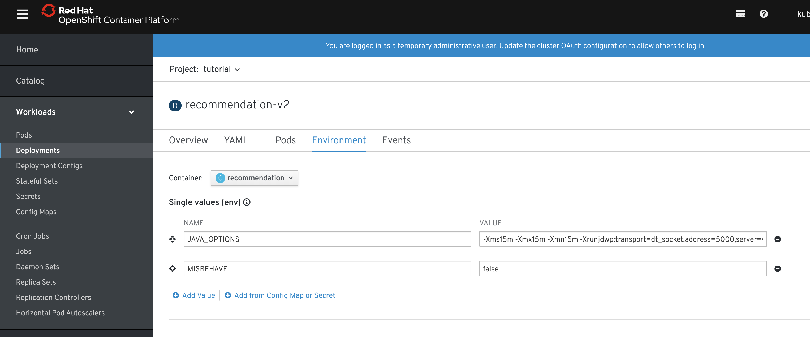
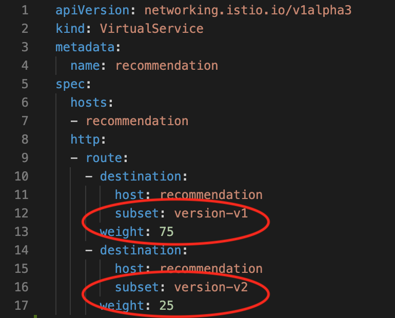

= OpenShift Meetup: November 2019

include:includes/common.adoc[]

Pre-requisites
====
1. Make sure ServiceMesh Operator is installed on cluster
2. Run link:scripts/01-provision-service-mesh.sh[01-provision-service-mesh.sh] to start up the service mesh control plane (once fully installed)
3. Run link:scripts/02-project-no-service-mesh-setup.sh[02-project-no-service-mesh-setup.sh] to create the project with the toy app
3. Run link:scripts/03-project-apply-service-mesh.sh[03-project-apply-service-mesh.sh] to add the toy app to the service mesh

Make sure the toy app has sidecars installed
====

Window Setup: Visible
====
1. A shell for running the load script continuously
2. A shell for running one off commands and displaying contents of yaml
3. A browser with tabs for Kiali, Jaeger, endpoints, and link:file:/Users/marc.hildenbrand/Documents/Development/service-mesh-demo/walkthrough/meetup.adoc[this script]
4. VSCode with the Java Project
====

== Runtime Complexity

Our toy app has some problems out of the gate.  Let's run calls to it in a window and then use the ability to visualize the service mesh to pick apart what's going on

1. In a shell window where you are logged into the OpenShift cluster, run the following
----
$ cdh
$ ./project-load-gen.sh customer istio
Starting load gen for istio-ingressgateway-istio-system.apps.service-mesh.openshifttc.com/customer.  Proceed? (y/N)
----

2. Observe the output
----
customer => Error: 503 - preference => 503 recommendation misbehavior from '67c49fb99b-9d6tf'

Customer customer-v2-66bd8ffc8d-w9sfr => unknown
customer => Error: 503 - preference => 503 recommendation misbehavior from '67c49fb99b-9d6tf'

customer => Error: 503 - preference => 503 recommendation misbehavior from '67c49fb99b-9d6tf'

Customer customer-v2-66bd8ffc8d-w9sfr => recommendation v1 from '69d8cd757c-qr6hn': 4618

customer => Error: 503 - preference => 503 recommendation misbehavior from '67c49fb99b-9d6tf'

Customer customer-v2-66bd8ffc8d-w9sfr => unknown
customer => preference => recommendation v1 from '69d8cd757c-qr6hn': 4619
customer => Error: 503 - preference => 503 recommendation misbehavior from '67c49fb99b-9d6tf'

customer => preference => recommendation v1 from '69d8cd757c-qr6hn': 4620
customer => preference => recommendation v1 from '69d8cd757c-qr6hn': 4621
Customer customer-v2-66bd8ffc8d-w9sfr => recommendation v1 from '69d8cd757c-qr6hn': 4622

Customer customer-v2-66bd8ffc8d-w9sfr => recommendation v1 from '69d8cd757c-qr6hn': 4623

customer => preference => recommendation v1 from '69d8cd757c-qr6hn': 4624
Customer customer-v2-66bd8ffc8d-w9sfr => unknown
----

3. Open link:https://kiali-istio-system.apps.service-mesh.openshifttc.com/console/graph/namespaces/?edges=requestsPercentage&graphType=versionedApp&namespaces=demo-app&unusedNodes=true&injectServiceNodes=true&duration=60&pi=15000&layout=dagre[Kiali], and make sure to open the project as seen here
image:images/kiali-initial-open.png[]

4. Open link:https://jaeger-istio-system.apps.service-mesh.openshifttc.com/search?end=1573387058622000&limit=20&lookback=1h&maxDuration&minDuration&service=recommendation&start=1573383458622000[Jaeger Trace] to inspect some of the items with failures.  Put *"recommendation"* in the search box to get traces that end with it
image:images/jaeger-trace.png[]

OPTIONAL:
====
Show the link:https://kiali-istio-system.apps.service-mesh.openshifttc.com/console/istio?namespaces=demo-app[Istio Configuration from kiali] and reinforce the concepts of Gateways, VirtualServices, and Destination Rules.
====

== Resilence

=== Dark Release

The recommendation service v2 is failing.  Let's pull it out of production and instead mirror traffic that comes into it so that we might be able to figure out what's going on.

1. Open the link:istiofiles/virtual-service-recommendation-v1-mirror-v2.yml[istiofiles/virtual-service-recommendation-v1-mirror-v2.yml] yaml in shell (or VSCode) for inspection:

image:images/recommendation-dark-release.png[]

2. Apply the changes
----
$ cdh
$ oc apply -f istiofiles/virtual-service-recommendation-v1-mirror-v2.yml
virtualservice.networking.istio.io/recommendation configured
----

3. Go to the continous invocation shell and notice errors going to 0

4. Open link:https://kiali-istio-system.apps.service-mesh.openshifttc.com/console/graph/namespaces/?edges=requestsPercentage&graphType=versionedApp&namespaces=demo-app&unusedNodes=true&injectServiceNodes=true&duration=60&pi=15000&layout=dagre[Kiali] and notice that error rate has gone to 0.

5. To see the actual mirrored calls, we need to look to link:https://jaeger-istio-system.apps.service-mesh.openshifttc.com/search?end=1573388314241000&limit=20&lookback=1h&maxDuration&minDuration&service=recommendation&start=1573384714241000[Jaeger] searching again for *recommendation*

image:images/jaeger-dark-release.png[]

=== Remote Debugging

Let's connect to the remote service using VSCode to try to figure out what's going on

1. Open VSCode for the recommendation sub-project by going here:
----
$ cd ~/Documents/Development/service-mesh-demo/recommendation/java/quarkus/
$ code .
----

* Select *Open Folder in Container*

image::images/vscode_initialopen.png[]

* Show the development container: *Dockerfile*
** point out maven
** sdk
* Show *.devcontainer.json*
** show the kubernetes and java plugins
** show the args for the volume mount to get to user's home directory
** Spoiler: and the environment variable!

* Open the RecommendationResource.java and set breakpoint to: 
** public Response getRecommendations()

* Open Kubernetes extension
** Select cluster
** Select namespaces (ensure *demo-app* is selected)
** Select Workloads
** Select Pods

image::images/Kubernetes-Extension.png[]

* Find the Recommendation-v2 pod, right click and select attach
** Select Java
** Select the recommendation container (and not the side car)

==== Hitting the breakpoint and fixing
* Wait until breakpoint is hit
** show count in watch window
** Might be a little bit slow

* Walk through where the error is
** search for where 'misbehave' is set
** Notice it's from an ENVIRONMENT Variable

* Change the default from "true" to "false"

* Recompile the sources (*in VSCode bash*)
----
mvn clean install
----

image::images/run_maven.png[]

* Discuss how this container could now be built
** Show the other Dockerfile that is NOT in .devcontainer

==== Meanwhile: Quick fix in production

Since the problem is with and environment variable, this is something we can change

* Change the Environment Variable
** Can do in OpenShift directly (try this link:https://console-openshift-console.apps.service-mesh.openshifttc.com/k8s/ns/demo-app/deployments/recommendation-v2/environment[link])

** Add the new "MISBEHAVE" environment variable and set to *false*
** Hit save.  
** _Notice that pod is destroyed and recreated_

* Check link:https://jaeger-istio-system.apps.ato-demo-replica.openshifttc.com/search?end=1570535773031000&limit=20&lookback=1h&maxDuration&minDuration&service=preference&start=1570532173031000[Jaeger]
** Notice no errors
** Hit "Find Traces" multiple times to see if there's any change

==== Reinstating the service

1. Show this file link:istiofiles/virtual-service-recommendation-v1_and_v2_75_25.yml[virtual-service-recommendation-v1_and_v2_75_25.yml]

2. apply this file
----
$ cdh
$ oc apply -f istiofiles/virtual-service-recommendation-v1_and_v2_75_25.yml
virtualservice.networking.istio.io/recommendation configured
----

3. Go back to link:https://kiali-istio-system.apps.service-mesh.openshifttc.com/console/graph/namespaces/?edges=requestsPercentage&graphType=versionedApp&namespaces=demo-app&unusedNodes=true&injectServiceNodes=true&duration=60&pi=15000&layout=dagre[Kiali] and show the traffic showing up
** Over time the call rate should approach 75/25

image:images/kiali-recommendation-75-25.png[]

== Security

Let's pretend