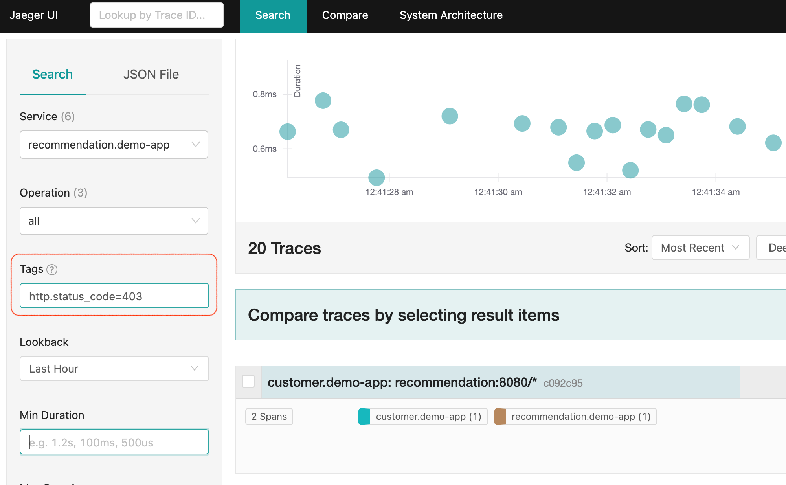

:experimental:
:toc:
:toc-levels: 4

= Service Mesh Demo [2020 Edition]

[IMPORTANT]
====
Before attempting this run through be sure to:

. Be sure to setup the demo per link:../readme.adoc[README]
. Open a shell and navigate to the root of this repo
. Run the following command:
+
----
docker run -it -v ~/.kube:/home/jboss/.kube -v ~/.oh-my-zsh:/home/jboss/.oh-my-zsh -v $(pwd):/workspaces/service-mesh-demo -w /workspaces/service-mesh-demo quay.io/mhildenb/sm-demo-shell:latest /bin/zsh
----
+
. If all ran successfully you should see the following:
+
----
DEMO_HOME is /workspaces/service-mesh-demo
PROJECT_PREFIX is demo-app
Welcome to the Service Mesh Demo.
➜  service-mesh-demo git:(feature-sm2) ✗ 
----
====

.Window Setup: Visible
====
1. A shell for running the load script continuously
2. A shell for running one off commands 
3. VSCode opened to the service mesh project for showing certain yaml files with highlighting
----
cd $DEMO_HOME
code .
----
3. *IMPORTANT:* A browser with tabs for Kiali, Jaeger, endpoints, and link:file:walkthrough/meetup.adoc[this script]
** If you don't have Jaeger and Kiali open then you haven't accepted the cert and it can cause other parts of the demo to fail
4. VSCode with the Java Project
====

== Preamble (for Live Demos)

We'll update a v3 recommendation service that will only be routeable with certain user-agent strings.  The installation script installed a fork of the microservices submodule in the cluster local gitea repo.  

. Open the Recommendation service for editing.
** You can quickly get to the file to edit in question like this:
+
----
GITEA_URL=$(oc get route gitea -n $PROJECT_PREFIX-cicd -o jsonpath='{.spec.host}')
echo "https://${GITEA_URL}/gogs/demo-microservices/_edit/master/recommendation/java/quarkus/src/main/java/com/redhat/developer/demos/recommendation/rest/RecommendationResource.java"
----
+
. Login when prompted.  Details are:
** User: `gogs`
** Pass: `gogs`
+
. Update the header string as pictured below (take a suggestion from the audience!)
+

+
. Commit the change
** This will automatically trigger a Tekton pipeline that will redeploy the Recommendation-v3 pod

== Demonstrate Observability (Runtime Complexity)

Our toy app has some problems out of the gate.  Let's run calls to it in a window and then use the ability to visualize the service mesh to pick apart what's going on

. In a shell window where you are logged into the OpenShift cluster, run the following
+
----
$DEMO_HOME/scripts/project-load-gen.sh customer --istio

Starting load gen for istio-ingressgateway-istio-system.apps.service-mesh.openshifttc.com/customer.  Proceed? (y/N)
----
+
. Observe the output
+
----
customer => Error: 503 - preference => Error: 503 - recommendation misbehavior from 'd9ff67b78-brxk2'
customer => Error: 503 - recommendation misbehavior from 'd9ff67b78-brxk2'
customer => preference => recommendation v1 from '5d978ff75b-dnbn7': 13628
customer => Error: 503 - recommendation misbehavior from 'd9ff67b78-brxk2'
customer => Error: 503 - recommendation misbehavior from 'd9ff67b78-brxk2'
customer => recommendation v1 from '5d978ff75b-dnbn7': 13629
customer => Error: 503 - recommendation misbehavior from 'd9ff67b78-brxk2'
customer => Error: 503 - recommendation misbehavior from 'd9ff67b78-brxk2'
customer => recommendation v1 from '5d978ff75b-dnbn7': 13630
customer => preference => recommendation v1 from '5d978ff75b-dnbn7': 13631
customer => recommendation v1 from '5d978ff75b-dnbn7': 13632
customer => recommendation v1 from '5d978ff75b-dnbn7': 13633
customer => preference => recommendation v1 from '5d978ff75b-dnbn7': 13634
customer => preference => recommendation v1 from '5d978ff75b-dnbn7': 13635
customer => Error: 503 - recommendation misbehavior from 'd9ff67b78-brxk2'
customer => recommendation v1 from '5d978ff75b-dnbn7': 13636
----
+
. Open link:https://kiali-istio-system.apps.service-mesh-demo.openshifttc.com/console/graph/namespaces/?edges=noEdgeLabels&graphType=versionedApp&namespaces=demo-app&unusedNodes=true&injectServiceNodes=true&duration=60&pi=10000&layout=dagre[Kiali], and make sure to open the project as seen here
+
[NOTE]
.Get Kiali Host
====
You can get the kiali host by issuing this command
----
echo "https://$(oc get route kiali -o=jsonpath='{.spec.host}' -n $PROJECT_PREFIX-istio-system)/"
----

Or you can use istioctl to open up a port forward
----
istioctl d kiali -i $PROJECT_PREFIX-istio-system
----
====
+
image:images/kiali-initial-open.png[]
+
. Open link:https://jaeger-istio-system.apps.service-mesh-demo.openshifttc.com/search?end=1574598630733000&limit=20&lookback=1h&maxDuration&minDuration&service=recommendation&start=1574595030733000[Jaeger Trace] to inspect some of the items with failures.  
+
[NOTE]
.Get Jaeger Host
====
You can open Jaeger directly from Kiali using the `Distributed Tracing` link on the drawer on the left (as seen in image to the right)

.Distributed Tracing link from Kiali
image::images/dist-trace-link.png[300,392,role="right"]

Alternatively you can get the jaeger host by issuing this command
----
echo "https://$(oc get route jaeger -o=jsonpath='{.spec.host}' -n demo-app-istio-system)/"
----

Or you can use istioctl to open up a port forward
----
istioctl d jaeger -i demo-app-istio-system
----
====
+
. Put `recommendation.demo-app` in the search box to get traces that end with it
+

== Resilence

=== Dark Release

The recommendation service v2 is failing.  Let's pull it out of production and instead mirror traffic that comes into it so that we might be able to figure out what's going on.

. From within VSCode, use kbd:[CMD+P] to quickly open the link:istiofiles/virtual-service-recommendation-v1-mirror-v2.yml[istiofiles/virtual-service-recommendation-v1-mirror-v2.yml] yaml for inspection:
+
image:images/recommendation-dark-release.png[]
+
. Apply the changes to the cluster
+
----
oc apply -f $DEMO_HOME/istiofiles/virtual-service-recommendation-v1-mirror-v2.yml -n $PROJECT_PREFIX
virtualservice.networking.istio.io/recommendation configured
----
+
. Go to the continous invocation shell and notice errors going to 0
+
. Open link:https://kiali-istio-system.apps.service-mesh.openshifttc.com/console/graph/namespaces/?edges=requestsPercentage&graphType=versionedApp&namespaces=demo-app&unusedNodes=true&injectServiceNodes=true&duration=60&pi=15000&layout=dagre[Kiali] and notice that error rate has gone to 0.
+
----
echo "https://$(oc get route kiali -o=jsonpath='{.spec.host}' -n $PROJECT_PREFIX-istio-system)/"
----
+
. To prove that traffic is actually going to v2 of the service, select the deployment from the Topology View and then click on the `view logs` link next to the pod.
+
|===
|Topology |Logs

|image:images/topology-view.png[]
|

|===

=== Remote Debugging

Let's connect to the remote service using VSCode to try to figure out what's going on 

[WARNING]
====
[red]#If your connection is slow, the remote debugger might take a long time to connect and step through the code#
====

. First, be sure to stop any loadgen
. Open VSCode for the recommendation sub-project by quickly opening the RecommendationController.java
** Use kbd:[CMD+P] to open the link:../microservices/recommendation/java/springboot/src/main/java/com/redhat/developer/demos/recommendation/RecommendationController.java[RecommendationController.java]
. Set a breakpoint at top of `getRecommendations` method:
+

+
. Next, open Kubernetes VSCode extension from the sidebar on the right
** Select cluster
** Select namespaces (ensure *demo-app* is selected)
** Select Workloads
** Select Pods
+
image::images/Kubernetes-Extension.png[]
+
. Find the Recommendation-v2 pod, right click and select attach
** Select Java
** Select the recommendation container (and not the side car)

==== Hitting the breakpoint and fixing

. Assuming loadgen has been stopped, make a single call to the endpoint
+
----
$DEMO_HOME/scripts/project-load-gen.sh customer --istio
Continuous load gen for istio-ingressgateway-istio-system.apps.cluster-bne-d92d.bne-d92d.example.opentlc.com/customer?  Press Y to proceed and N for single call (y/N)

Calling endpoint once
customer => preference => recommendation v1 from '69d8cd757c-rqkj6': 1833
----
+
. Wait until breakpoint is hit
** show count in watch window
** Might be a little bit slow
+
[INFO]
.Signs that the debugger is attaching
====
If the debugger connection is slow, you can show that the connection has been made by going to the debug panel and looking at the threads
image:images/debugger-attach-sign.png[]
====
+
. Walk through where the error is
** search for where 'misbehave' is set
** Notice it's from an ENVIRONMENT Variable

NOTE: If you don't want to show the code being fixed and recompiled then jump to <<Meanwhile: Quick fix in production,Production fix>>

===== Option 1: Hot Swap Code to test
. Allow the debugger to continue execution

. Change the default from "true" to "false" and save the file

. Click the hotswap button, notice that the class begins transmit
+
image::images/hot-swap.png[]
+
. [red]#Set a breakpoint at the end of the function to prove that this return can now get hit#

. Submit another request to the endpoint after the upload of the class is done.
+
----
$DEMO_HOME/scripts/project-load-gen.sh customer --istio
----
+
. Show that the end return endpoint is now being hit
+
. Open Kiali and show that most recent call doesn't show the endpoint getting hit.
+
. Next, show that this change was ephemeral by stopping the debugger and deleting the pod
+
image::images/delete-now.png[]
+
. Resubmit a request
+
----
$DEMO_HOME/scripts/project-load-gen.sh customer --istio
----
+
. Show that the error re-appears in Kiali

===== Option 2: Fix, recompile, and upload

. Recompile the sources (*in VSCode bash*)
+
----
cd $DEMO_HOME/microservices/recommendation/java/springboot
mvn clean install
oc new-build --name recommendation-v2 java:11 --binary -l app=recommendation,version=v2 -e JAVA_APP_JAR=recommendation.jar  -e JAVA_TOOL_OPTIONS="-Xdebug -Xrunjdwp:transport=dt_socket,address=5005,server=y,suspend=n" -n $PROJECT_PREFIX
oc start-build recommendation-v2 --from-dir target --follow -n $PROJECT_PREFIX
----
+
image::images/run_maven.png[]
+
. Discuss how this container could now be built
** Show the other Dockerfile that is NOT in .devcontainer
. The deployment was already setup to point to the image stream to which we built.  We just need to delete the running pod to allow a new pod with the new image to replace it
+
----
oc delete po -l app=recommendation,version=v2 -n $PROJECT_PREFIX
----

==== Meanwhile: Quick fix in production

Since the problem is with and environment variable, this is something we can change

. Change the Environment Variable
** Can do in OpenShift directly (try this link:https://console-openshift-console.apps.service-mesh.openshifttc.com/k8s/ns/demo-app/deployments/recommendation-v2/environment[link])
+
image::images/Misbehave_False.png[]
+
. Add the new "MISBEHAVE" environment variable and set to *false*
. Hit save.  
+
[NOTE]
.Setting the environment variable in the deployment instead
====
----
oc set env deployment/recommendation-v2 MISBEHAVE="false"
----
====
+
. _Notice that pod is destroyed and recreated_
+
. Restart loadgen if necessary
+
----
$DEMO_HOME/scripts/project-load-gen.sh customer --istio                                                        Continuous load gen for istio-ingressgateway-istio-system.apps.cluster-bne-d92d.bne-d92d.example.opentlc.com/customer?  Press Y to proceed and N for single call (y/N)y
----
+
. Check Jaeger
+
----
# Allow istioctl to setup port forwarding for us and we connect on localhost
istioctl d jaeger -i demo-app-istio-system

# OR you can get it the oldfashioned way
echo "https://$(oc get route jaeger -o=jsonpath='{.spec.host}' -n demo-app-istio-system)/"
----
+
** Notice no errors
** Hit "Find Traces" multiple times to see if there's any change

==== Reinstating the service

Next we'll slowly return live traffic to the recommendation endpoint.

. Return to the VSCode instance that you opened at the root of the demo and restart loadgen
+
----
$DEMO_HOME/scripts/project-load-gen.sh customer --istio
----
+
. Use kbd:[CMD+P] to navigate quickly to this file link:istiofiles/virtual-service-recommendation-v1_and_v2_75_25.yml[virtual-service-recommendation-v1_and_v2_75_25.yml]
+
image:images/virtual-service-75-25.png[]
+
. apply this file to the cluster
+
----
kubectl apply -f $DEMO_HOME/istiofiles/virtual-service-recommendation-v1_and_v2_75_25.yml

virtualservice.networking.istio.io/recommendation configured
----
+
. Use `istioctl` to show how the route has been updated
+
----
istioctl x des service recommendation -i $PROJECT_PREFIX-istio-system -n $PROJECT_PREFIX
----
+
----
Service: recommendation
   Port: http 8080/HTTP targets pod port 8080
DestinationRule: recommendation for "recommendation"
   Matching subsets: version-v1,version-v2
   No Traffic Policy
VirtualService: recommendation
   Weight 75%
   Weight 25%
----
+
. Go back to link:https://kiali-istio-system.apps.service-mesh.openshifttc.com/console/graph/namespaces/?edges=requestsPercentage&graphType=versionedApp&namespaces=demo-app&unusedNodes=true&injectServiceNodes=true&duration=60&pi=15000&layout=dagre[Kiali] and show the traffic showing up
** Over time the call rate should approach 75/25
+
image:images/kiali-recommendation-75-25.png[]

== Security

Let's pretend that we discover that the customer service should never be calling the recommendation service directly.  We can enforce this by setting up access rules that ensure a given path through the system

=== Stopping all Traffic

. Make sure requests are consistently coming into the mesh
+
----
$DEMO_HOME/scripts/project-load-gen.sh customer --istio
----
+
. In VSCode, use kbd:[CMD+p] and start searching for `authorization-policy-deny-all.yaml`
+
image:images/denier.png[]
+
. Explain that this will effectively stop all traffic through the mesh.  Run the following command to apply it:
+
----
kubectl apply -n $PROJECT_PREFIX -f $DEMO_HOME/istiofiles/authorization/authorization-policy-deny-all.yaml
----
+
. Switch to the shell and you should see evidence of the change
+
----
RBAC: access deniedRBAC: access deniedRBAC: access deniedRBAC: access deniedRBAC: access denied
----
+
. Switch to Kiali and show that traffic through the mesh has effectively been halted with 100% of the traffic returning `HTTP 403`
+

=== Reinstating Authorized flow to customer

. Make sure loadgen is still running in the background
. In VSCode, use kbd:[CMD+p] and start searching for `authorization-policy-allow-customer.yaml`
+
image:images/auth-policy-allow-customer.png[]
+
. Explain that this is stating that for any pod that matches the selector (namely `customer`) we will allow GET calls
. With Kiali and the loadgen visible, apply the authorization policy
+
----
kubectl apply -n $PROJECT_PREFIX -f $DEMO_HOME/istiofiles/authorization/authorization-policy-allow-customer.yaml
----
+
. Show that calls to customer can now be made, but nothing else is going through:
+
----
customer => Error: 403 - RBAC: access denied
customer => Error: 403 - RBAC: access denied
customer => Error: 403 - RBAC: access denied
----
+

=== Defining an approved path through the mesh

. First we need to set the scenes for this.  From the topology view, take a closer look at one of the customer service pods (Deployment->Resources->Pod->YAML)
+

+
. Point out that it is running as a service account called "customer". This will feed into information about a *prinicpal*.  Principals are only valid when running something like mTLS
+
. In VSCode, use kbd:[CMD+p] and start searching for `authorization-policy-allow-preference.yaml`
+
. Point out the highlighted parts of the preference authorization
+

+
. Show the same for recommendation, kbd:[CMD+p] `authorization-policy-allow-recommendation.yaml` (explaining that preference is running on a service account also based on that name)
+

+
. Point out that there is no authorization in recommendation for the `customer` service account to call it, only `preference`
. Now apply all the changes to the mesh to enforce our policy (this will create or reapply all the files we've shown to this point)
+
----
kubectl apply -n $PROJECT_PREFIX -f $DEMO_HOME/istiofiles/authorization
----
+
. Reasonably soon after applying the yaml, output from the shell should show this too:
+
----
customer => preference => recommendation v1 from '6669f7c6b8-l6tv5': 1260
customer => Error: 403 - RBAC: access denied
customer => Error: 403 - RBAC: access denied
customer => Error: 403 - RBAC: access denied
customer => preference => recommendation v1 from '6669f7c6b8-l6tv5': 1261
customer => preference => recommendation v2-buggy from '559c797886-hz28k'.
customer => Error: 403 - RBAC: access denied
customer => preference => recommendation v2-buggy from '559c797886-hz28k'.
customer => Error: 403 - RBAC: access denied
customer => preference => recommendation v1 from '6669f7c6b8-l6tv5': 1262
customer => Error: 403 - RBAC: access denied
customer => preference => recommendation v1 from '6669f7c6b8-l6tv5': 1263
----
+
. you can look deeper in Jaeger by searching for `http.status_code=403`
+

+
The (most recent) traces presented should represent direct customer->recommendation inactions, like this one:
+

+
[OPTIONAL]
.Quickly remove the restrictions
====

You can remove all the AuthorizationPolicies quickly by simply deleting the relevant CRs from the cluster:

----
kubectl delete -n $PROJECT_PREFIX -f $DEMO_HOME/istiofiles/authorization 
----
----
authorizationpolicy.security.istio.io "customer-viewer" deleted
authorizationpolicy.security.istio.io "preference-viewer" deleted
authorizationpolicy.security.istio.io "recommendation-viewer" deleted
authorizationpolicy.security.istio.io "deny-all" deleted
----

====
+
. To get rid of the offending customer service, navigate (using kbd:[CMD+p]) to start searching for `virtual-service-customer-v1_only.yml`
. Point out that this file is updating our customer virtual service to only call the properly functioning v1 of the service
. Now apply the changes
+
----
kubectl apply -n $PROJECT_PREFIX -f $DEMO_HOME/kube/customer/virtual-service-customer-v1_only.yml
----
+
. Immediately RBAC errors in the shell should stop
. Go back to Kiali.  The 403 errors should fade over time

=== OPTIONAL: Principals and mTLS

. To be able to make authorization policy rules based on prinicpals, you must have mTLS enabled in your mesh
. mTLS is enabled by default, this can be made apparent by visualizing this in Kiali
+

+
. In VSCode use kbd:[CMD+p] to quickly open `disable-mtls.yml`
. Turn off mtls by applying the yaml (to change the `PeerAuthentication`)
+
----
kubectl apply -n $PROJECT_PREFIX -f $DEMO_HOME/istiofiles/mTLS/disable-mtls.yml
----
. Show that all principal based AuthorizationPolicies now fail (only calls into customer can be made)
+
----
customer => Error: 403 - RBAC: access denied
customer => Error: 403 - RBAC: access denied
customer => Error: 403 - RBAC: access denied
customer => Error: 403 - RBAC: access denied
----
+
. Notice also that the lock icons are now missing from *Kiali Dashboard*
** NOTE: It might take a few seconds for connections to update
. In VSCode use kbd:[CMD+p] to quickly open `enable-mtls.yml`
. Reinstate mTLS by running the following command:
+
----
kubectl apply -n $PROJECT_PREFIX -f $DEMO_HOME/istiofiles/mTLS/enable-mtls.yml
----

== Route based on Headers

[NOTE]
====
Some things to note about this section:

* This is demonstrated best when all traffic is routed only to v1 of the customer
* You might consider setting up a QR Code and/or a bit.ly link to your istio gateway so people can see this working
* Instructions use the Firefox version of the header, but points will call out where you can use the iPhone version of the header if that is more appropriate to your audience
** Replace `virtual-service-recommendation-header-firefox.yml` with `virtual-service-recommendation-header-iPhone.yml`
** You can issue this command to fake an iPhone call
+
----
$DEMO_HOME/scripts/project-load-gen.sh customer --istio -h "User-Agent: Pretend iPhone OS Test"
----
====

In this section we show that we can use Istio as a layer 7 loadbalancer allowing us to route people through the mesh based on headers.  In this example, people that access the mesh with the right User-Agent header will be able to see a special message that is displayed by the `Recommendation-v3` service that we setup <<Preamble (for Live Demos),earlier in this walkthrough>>

. In VSCode use kbd:[CMD+P] to quickly open `virtual-service-recommendation-header-firefox.yml`

. Review the file and then apply it to the cluster
+
----
oc apply -n $PROJECT_PREFIX -f $DEMO_HOME/istiofiles/headers/virtual-service-recommendation-header-firefox.yml
----
+
. [blue]#OPTIONAL:# Now you can show the audience what has just been setup using istioctl
+
----
istioctl x describe pod -i $PROJECT_PREFIX-istio-system -n $PROJECT_PREFIX $(oc get pods -n $PROJECT_PREFIX | grep -i recommendation-v3 | grep Running | awk '{print $1}')
----
+
** Successful output will look like this (if output doesn't match, then look to <<Debugging with Istioctl,Troubleshooting>> section)
+
----
Pod: recommendation-v3-5896d9c455-htczf
   Pod Ports: 8080 (recommendation-v3), 15090 (istio-proxy)
--------------------
Service: recommendation
   Port: http 8080/HTTP targets pod port 8080
DestinationRule: recommendation for "recommendation"
   Matching subsets: version-v3
      (Non-matching subsets version-v1,version-v2)
   No Traffic Policy
VirtualService: recommendation
   when headers are baggage-user-agent=regex:".*Firefox/.*"
   1 additional destination(s) that will not reach this pod
RBAC policies: ns[demo-app]-policy[recommendation-viewer]-rule[0]
--------------------
Service: recommendation-v3
   Port: http 8080/HTTP targets pod port 8080
RBAC policies: ns[demo-app]-policy[recommendation-viewer]-rule[0]
----
+
.A slightly less useful version of the above command
====
You can also query at the service level to look at the overall service instead of what requests will be reaching the pod

----
istioctl x describe svc recommendation -i $PROJECT_PREFIX-istio-system -n $PROJECT_PREFIX
----
Generates this (slightly confusing) output:
----
Service: recommendation
   Port: http 8080/HTTP targets pod port 8080
DestinationRule: recommendation for "recommendation"
   Matching subsets: version-v1,version-v2,version-v3
   No Traffic Policy
VirtualService: recommendation
   when headers are baggage-user-agent=regex:".*Firefox/.*"
   Weight 50%
   Weight 50%
RBAC policies: ns[demo-app]-policy[recommendation-viewer]-rule[0]
----
====
+
. Issue a command with a non-compatible user agent
+
----
$DEMO_HOME/scripts/project-load-gen.sh customer --istio -h "User-Agent: Pretend Browser"
----
+
. Notice that there is no change in what's returned.
. Now attempt to start load with a suitable user-agent (or simply access the istio-ingress with Firefox)
+
----
$DEMO_HOME/scripts/project-load-gen.sh customer --istio -h "User-Agent: Pretend Firefox/Mozilla"
----
+
. You should now only see the following returned (if you opted for more than one call)
+
----
customer => preference => recommendation v3 from '5896d9c455-htczf': 70
customer => preference => recommendation v3 from '5896d9c455-htczf': 71
customer => preference => recommendation v3 from '5896d9c455-htczf': 72
customer => preference => recommendation v3 from '5896d9c455-htczf': 73
----

== Troubleshooting

=== Upstream connect error (and policies)

If you *apply the security policies* and you see this error in certain situations
----
customer => Error: 503 - upstream connect error or disconnect/reset before headers. reset reason: connection termination
----

It might be due to a kubernetes service not naming a port properly.  You might try `istioctl validate` to the service in question and see what you get back.  For instance:

----
$ kubectl get services -o yaml |istioctl validate -i $PROJECT_PREFIX-istio-system -f -
Error: 1 error occurred:
        * List//: service "recommendation-v3/demo-app/:" port "8080-tcp" does not follow the Istio naming convention. See https://istio.io/docs/setup/kubernetes/prepare/requirements/
----

This can be fixed by naming the port in question `http`

=== Debugging with Istioctl

You can look up route information by using the following command (where _recommendation-v3-5-jsxm9_ is the podname to which you want determine routes).  This output shows that there are none
----
istioctl x describe pod -i $PROJECT_PREFIX-istio-system recommendation-v3-5-jsxm9

Pod: recommendation-v3-5-jsxm9
   Pod Ports: 8443 (recommendation-v3), 8778 (recommendation-v3), 8080 (recommendation-v3), 15090 (istio-proxy)
Suggestion: add 'version' label to pod for Istio telemetry.
--------------------
Service: recommendation-v3
   Port: 8080-tcp 8080/UnsupportedProtocol targets pod port 8080
   Port: 8443-tcp 8443/UnsupportedProtocol targets pod port 8443
   Port: 8778-tcp 8778/UnsupportedProtocol targets pod port 8778
8080 Pod is PERMISSIVE (enforces HTTP/mTLS) and clients speak HTTP
8443 Pod is PERMISSIVE (enforces HTTP/mTLS) and clients speak HTTP
8778 Pod is PERMISSIVE (enforces HTTP/mTLS) and clients speak HTTP
----
